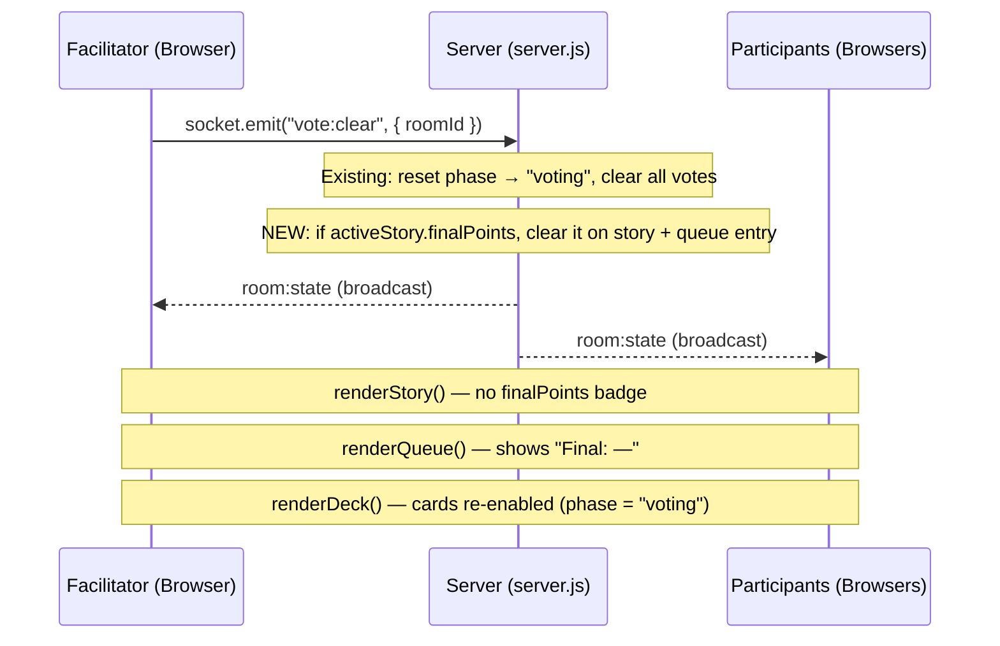

# Design Document: Clear / Revote Finalized Story

## Overview

This feature extends the existing `vote:clear` flow in FLAPS so that when a Facilitator triggers "Clear / Revote" on a story that already has a finalized point value, that `finalPoints` value is also cleared — both on the active story object and on the corresponding Story Queue entry. The change is minimal and surgical: a two-line addition to the server-side `vote:clear` handler, with no new events, no new UI elements, and no schema changes.

The client already re-renders from the authoritative `room:state` broadcast, so clearing `finalPoints` on the server is sufficient to update all connected clients automatically.

## Architecture

FLAPS uses a simple client-server architecture over Socket.IO:



The only change to the data flow is inside the `vote:clear` handler on the server. Everything downstream (broadcast, client rendering) already handles a `null` `finalPoints` correctly.

## Components and Interfaces

### Server: `vote:clear` handler (`server.js`)

Current behavior:
1. Validates moderator
2. Sets `room.phase = "voting"`
3. Clears all `room.users[id].vote` to `null`
4. Broadcasts updated state

New behavior (additions only):
- After step 2, if `room.activeStoryId` is set and `room.story.finalPoints` is non-null:
  - Set `room.story.finalPoints = null`
  - Find the matching entry in `room.storyQueue` by `room.activeStoryId` and set its `finalPoints = null`

No new Socket.IO events are introduced. The existing `vote:clear` event is extended in place.

### Client: `renderStory(story)` (`public/app.js`)

No changes required. The function already conditionally renders the `pointsBadge` only when `story.finalPoints` is truthy:

```js
if (story?.finalPoints) {
  const pts = document.createElement('span');
  pts.className = 'pointsBadge';
  pts.textContent = `Final: ${story.finalPoints}`;
  title.appendChild(pts);
}
```

When `finalPoints` is `null`, no badge is rendered.

### Client: `renderQueue(state)` (`public/app.js`)

No changes required. The function already renders `"Final: —"` when `finalPoints` is falsy:

```js
points.textContent = s.finalPoints ? `Final: ${s.finalPoints}` : 'Final: —';
```

### Client: `renderDeck(deck, phase, hasActiveStory)` (`public/app.js`)

No changes required. Cards are already re-enabled when `phase === "voting"`, which is set by the existing clear logic.

### Client: Finalize Estimate controls

No changes required. The `canFinalize` logic in the `room:state` handler already gates on `state.phase === 'revealed'`, so after a revote the controls will be re-enabled once the Facilitator reveals again.

## Data Models

### Room object (in-memory, `server.js`)

```js
{
  roomId: String,
  deck: String[],
  phase: "voting" | "revealed",
  story: {
    title: String,
    desc: String,
    link: String,
    finalPoints: String | null   // ← cleared to null on vote:clear
  },
  storyQueue: [
    {
      id: String,
      title: String,
      desc: String,
      link: String,
      finalPoints: String | null  // ← cleared to null on vote:clear (active entry only)
    }
  ],
  activeStoryId: String | null,
  users: { [socketId]: { name: String, vote: String | null } },
  moderatorKey: String,
  createdAt: Number,
  lastActiveAt: Number
}
```

The only state mutation introduced by this feature:

| Field | Before clear | After clear (new behavior) |
|---|---|---|
| `room.story.finalPoints` | `"5"` (or any value) | `null` |
| `room.storyQueue[i].finalPoints` (active entry) | `"5"` (or any value) | `null` |

All other fields are unchanged from existing `vote:clear` behavior.


## Correctness Properties

*A property is a characteristic or behavior that should hold true across all valid executions of a system — essentially, a formal statement about what the system should do. Properties serve as the bridge between human-readable specifications and machine-verifiable correctness guarantees.*

### Property 1: Clear / Revote nullifies finalPoints on both active story and queue entry

*For any* room where the active story has a non-null `finalPoints` value, triggering `vote:clear` (as moderator) should result in both `room.story.finalPoints` and the matching `storyQueue` entry's `finalPoints` being `null`.

**Validates: Requirements 1.1, 1.2**

### Property 2: Clear / Revote always resets votes and phase

*For any* room state (regardless of whether the active story is finalized), triggering `vote:clear` should set `room.phase` to `"voting"` and set every user's `vote` to `null`.

**Validates: Requirements 1.3, 1.4**

### Property 3: Rendering null finalPoints shows no badge and "Final: —"

*For any* story object with `finalPoints = null`, `renderStory` should produce a story view with no `pointsBadge` element; and for any queue entry with `finalPoints = null`, `renderQueue` should display the text `"Final: —"`.

**Validates: Requirements 2.1, 2.2**

### Property 4: Finalize controls are enabled exactly when moderator + revealed + active story

*For any* room state where `youAreModerator = true`, `phase = "revealed"`, and `activeStoryId` is non-null, the Finalize Estimate button and final points dropdown should be enabled; and for any state where any of those conditions is false, they should be disabled.

**Validates: Requirements 3.1**

### Property 5: Clear then finalize round-trip stores the new value

*For any* room where the active story has been finalized, if `vote:clear` is triggered followed by `vote:reveal` and then `storyQueue:finalize` with a new point value, then `room.story.finalPoints` and the matching queue entry's `finalPoints` should equal the new value (not the old one, and not null).

**Validates: Requirements 3.2**

## Error Handling

The feature introduces no new error paths. The existing `vote:clear` handler already:
- Returns early if the room does not exist
- Returns early if the socket is not the moderator

The new `finalPoints` clearing logic is guarded by the same moderator check and only executes when `room.activeStoryId` is set and `room.story.finalPoints` is non-null, so it is safe to add without additional error handling.

One edge case to be aware of: if `room.activeStoryId` is set but the corresponding entry is not found in `room.storyQueue` (e.g., it was removed concurrently), the queue-clearing step should be a no-op (the `Array.find` will return `undefined` and the assignment is skipped). This is consistent with existing defensive patterns in the codebase.

## Testing Strategy

### Unit Tests

Unit tests should cover specific examples and edge cases:

- `vote:clear` on a room with a finalized active story → `room.story.finalPoints` is `null`
- `vote:clear` on a room with a finalized active story → matching queue entry `finalPoints` is `null`
- `vote:clear` on a room with no finalized story → `room.story.finalPoints` remains `null` (no regression)
- `vote:clear` on a room with no active story → no error, phase and votes still reset
- `renderStory` with `finalPoints = null` → no `.pointsBadge` element in output
- `renderQueue` with a queue entry where `finalPoints = null` → text contains `"Final: —"`
- `storyQueue:finalize` after `vote:clear` → new `finalPoints` value is stored correctly

### Property-Based Tests

Use a property-based testing library (e.g., [fast-check](https://github.com/dubzzz/fast-check) for JavaScript) with a minimum of 100 iterations per property.

Each test is tagged with the design property it validates.

**Property 1: Clear / Revote nullifies finalPoints**
```
// Feature: clear-revote-finalized-story, Property 1: vote:clear clears finalPoints on both active story and queue entry
fc.assert(fc.property(
  arbitraryRoomWithFinalizedActiveStory(),
  (room) => {
    handleVoteClear(room);
    return room.story.finalPoints === null &&
           room.storyQueue.find(s => s.id === room.activeStoryId).finalPoints === null;
  }
), { numRuns: 100 });
```

**Property 2: Clear / Revote always resets votes and phase**
```
// Feature: clear-revote-finalized-story, Property 2: vote:clear always resets votes and phase
fc.assert(fc.property(
  arbitraryRoom(),
  (room) => {
    handleVoteClear(room);
    const allVotesNull = Object.values(room.users).every(u => u.vote === null);
    return room.phase === 'voting' && allVotesNull;
  }
), { numRuns: 100 });
```

**Property 3: Rendering null finalPoints**
```
// Feature: clear-revote-finalized-story, Property 3: renderStory/renderQueue with null finalPoints
fc.assert(fc.property(
  arbitraryStoryWithNullFinalPoints(),
  (story) => {
    renderStory(story);
    return document.querySelector('.pointsBadge') === null;
  }
), { numRuns: 100 });

fc.assert(fc.property(
  arbitraryQueueEntryWithNullFinalPoints(),
  (entry) => {
    // render queue with single entry
    const text = renderQueueEntry(entry);
    return text.includes('Final: —');
  }
), { numRuns: 100 });
```

**Property 4: Finalize controls enabled iff moderator + revealed + active story**
```
// Feature: clear-revote-finalized-story, Property 4: canFinalize logic
fc.assert(fc.property(
  fc.record({
    youAreModerator: fc.boolean(),
    phase: fc.constantFrom('voting', 'revealed'),
    activeStoryId: fc.option(fc.string({ minLength: 1 }))
  }),
  (state) => {
    applyRoomState(state);
    const expected = state.youAreModerator && state.phase === 'revealed' && !!state.activeStoryId;
    const btn = document.getElementById('finalizeEstimateBtn');
    return btn.disabled === !expected;
  }
), { numRuns: 100 });
```

**Property 5: Clear then finalize round-trip**
```
// Feature: clear-revote-finalized-story, Property 5: clear then finalize stores new value
fc.assert(fc.property(
  arbitraryRoomWithFinalizedActiveStory(),
  fc.constantFrom('1', '2', '3', '5', '8', '13', '21', '34', '☕', '?'),
  (room, newPoints) => {
    handleVoteClear(room);
    handleVoteReveal(room);
    handleFinalize(room, room.activeStoryId, newPoints);
    return room.story.finalPoints === newPoints &&
           room.storyQueue.find(s => s.id === room.activeStoryId).finalPoints === newPoints;
  }
), { numRuns: 100 });
```
