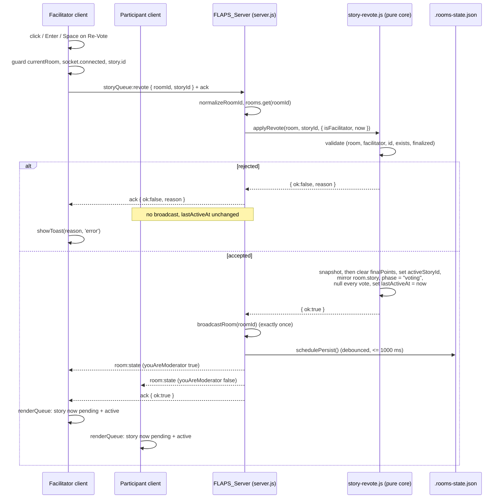
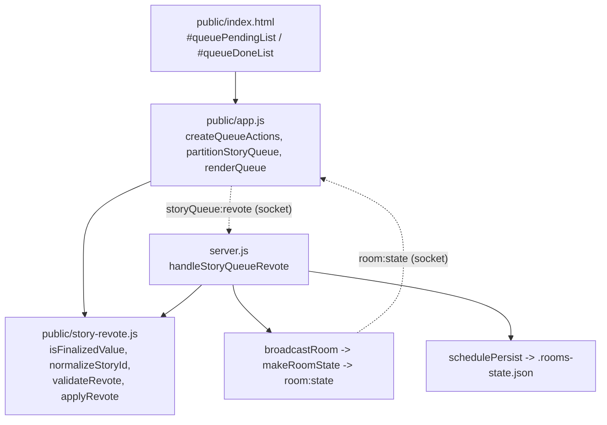
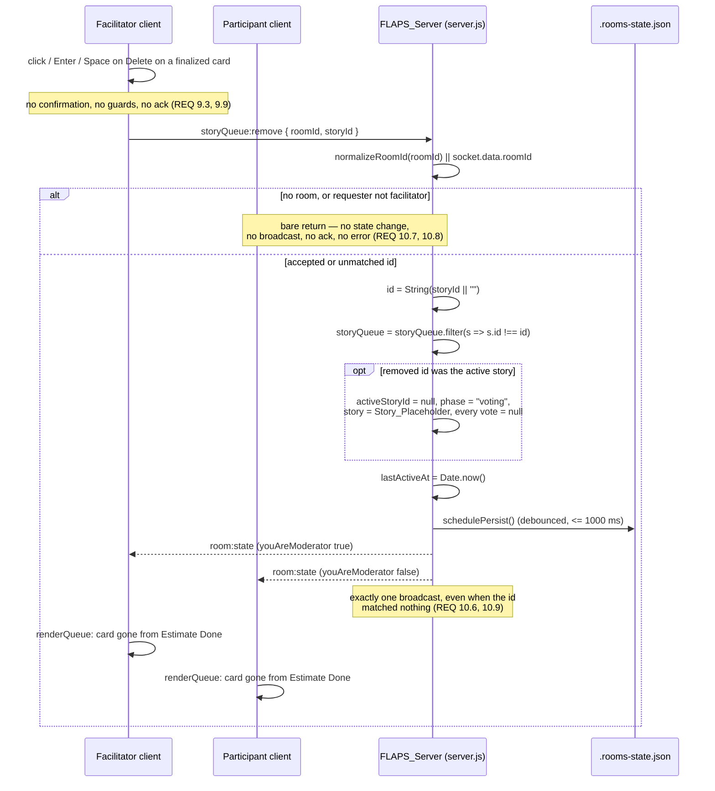

# Design Document

## Overview

Re-Vote reverses a finalize. A facilitator activates a Re-Vote button on a finalized story card; the server clears that story's `finalPoints`, makes it the active story, resets the room to `"voting"`, clears every vote, and broadcasts once. The story reappears in "Need Estimate" as the active story on every connected client, and the normal estimate → reveal → finalize flow runs again on the same queue entry.

The transition is deliberately modelled on the existing `handleStoryQueueSetActive` handler, which already does four of the five things a re-vote needs (set `activeStoryId`, mirror `room.story`, set `phase = "voting"`, null every vote). Re-vote adds one thing — clearing `finalPoints` — and one restriction: the target must currently be finalized.

Delete on a finalized card is a much smaller change, and deliberately so. The finalized card action area becomes `[final pill]` for a participant and `[final pill] [Delete ❌] [Re-Vote]` for a facilitator. The delete control is the *same* control pending cards already render — `createDeleteButton` — appended in the finalized branch of `createQueueActions`, emitting the existing `storyQueue:remove` event. `handleStoryQueueRemove` already removes any story id regardless of finalized status, resets the active-story slot when the removed entry was active, and broadcasts, so **the server needs no change at all**. Requirements 10 and 11 exist to pin that existing contract under test, not to alter it. The only production edits the delete enhancement needs are two lines in the finalized branch of `createQueueActions` and two attribute lines inside the shared `createDeleteButton` builder.

### Research and existing-code findings

Findings from reading `server.js`, `public/app.js`, and the test suite that shaped this design:

1. **`handleStoryQueueSetActive` is the precedent, including its error channel.** It is the only story-queue handler that reports failures, via a Socket.IO `ack` callback with `{ ok: false, reason }` / `{ ok: true }`. Sibling handlers (`finalize`, `remove`, `edit`) reject silently with a bare `return`. Requirement 4.1 demands a rejection response delivered "to the requesting socket only and to no other socket joined to the room", so silent-return is not an option and the ack channel is the natural fit (see *Error Handling* for the choice against `socket.emit("error")`).

2. **`handleVoteClear` already contains a partial version of the clear operation** — it nulls `room.story.finalPoints` and the matching queue entry's `finalPoints` when a story is active. It is scoped to the *active* story, has no finalized-status precondition, and reports nothing, so it cannot serve Requirement 1/2/4. It does confirm the mutation shape re-vote needs.

3. **The client has two different notions of "finalized".** `createQueueActions`, `createQueueItemElement`, and `partitionStoryQueue` test raw truthiness (`if (story.finalPoints)`), while the export path uses `hasFinalPoints(story)`, which trims. A whitespace-only `finalPoints` is truthy, so today it lands in "Estimate Done" with a blank pill — exactly what Requirement 1.10 forbids. This design unifies all four call sites on one shared trimming predicate.

4. **Existing debounced persistence already satisfies Requirement 7.4.** `broadcastRoom` calls `schedulePersist()`, which coalesces writes behind a single 1000 ms timer and serializes *live* room state at fire time, not at schedule time. So a re-vote is captured by a write that lands at most 1000 ms after its broadcast even when it piggybacks on a timer armed by an earlier mutation. No new code.

5. **Existing restore already satisfies Requirement 7.7.** `loadPersistedRooms()` restores `storyQueue` (with each entry's `finalPoints`), `activeStoryId`, `phase`, and `story`. A re-voted story therefore returns as pending and active after a restart with no new code.

6. **`broadcastRoom` emits per socket inside one `try`.** A throw from any single `s.emit(...)` would abort the loop and skip the remaining sockets, which conflicts with Requirement 7.6. One targeted hardening (per-socket `try`) is included.

7. **`selectedFinalPoint` is reset *after* rendering.** In the `room:state` handler, `renderAllComponents(...)` runs before `if (state.phase !== 'revealed' || !state.activeStoryId) selectedFinalPoint = null;`. On the broadcast that follows a re-vote, a stale non-null `selectedFinalPoint` would render a chip in the selected state, which Requirement 6.5 forbids. Fixed by ordering.

8. **`public/repro-highlight.test.js` is already failing on the current tree** (verified by running it). It asserts that a finalized *active* story keeps the `queueActive` highlight in the done section, which contradicts Requirement 6.9 ("`activeStoryId` … that matches no Pending_Story → apply the active-story highlight class to no Story_Card"). It is a red repro file, not a behavior contract. This design does not change the code path it exercises, so it stays red exactly as it is now; the *Testing Strategy* records the recommendation to retire it rather than satisfy it.

9. **`createDeleteButton` is already a shared builder, and it is deliberately unguarded.** `createDeleteButton(storyId, currentRoom, socket)` builds a `button.queueBtn` with `type="button"`, `textContent = '❌'`, `dataset.storyId`, and an `onclick` that calls `e.stopPropagation()` then emits `storyQueue:remove` with `{ roomId: currentRoom, storyId }`. There is no room guard, no `socket.connected` check, no ack callback, and no confirmation prompt. Pending cards call it and add the `queueIconBtn` class. Requirement 9.5 and Requirement 9.9 codify that unguarded behavior rather than asking for it to be tightened, so the finalized card gets the same builder untouched on the emit path — which is the whole point: one code path, one contract, verified by a metamorphic property against the pending path.

10. **`createDeleteButton` sets no `aria-label`, so its accessible name is today the `❌` emoji.** Requirement 1.12 asks for "Delete story". The fix goes inside the shared builder, which means the *pending* cards' delete buttons gain the same accessible name. That is an intentional improvement to a shared path with no functional effect: the label is the only change, it alters no class, no event, and no payload, and it makes an existing accessibility gap on pending cards go away for free. The alternative — labelling only the finalized instance at the call site — would leave two spellings of the same button and is rejected for that reason.

11. **`createDeleteButton` does not call `addKeyboardClickSupport`, and a native `<button>` does not need it.** In a real browser, Enter and Space on a focused `<button>` fire a `click`, so Requirement 9.2 is already satisfied by the element choice. jsdom does *not* synthesize that click from a `keydown`, so the requirement is unobservable in the existing test harness. The design resolves this explicitly rather than leaving it ambiguous — see *Components and Interfaces* section 4.

12. **`handleStoryQueueRemove` broadcasts even when the story id matches nothing.** It filters the queue unconditionally and then falls through to `room.lastActiveAt = Date.now()` and `broadcastRoom(roomId)`. An unmatched delete is therefore a *broadcasting* no-op, not a silent one: the queue is unchanged but `lastActiveAt` advances and every socket receives one `room:state`. Requirement 10.9 states exactly this, and Requirement 10.10's idempotence follows from it because the second delete of the same id is precisely the unmatched case. No change is made to that behavior; the design records it so a test written against an intuitive "no-op means no broadcast" assumption does not get written.

13. **The property tests caught a defect in the requirements, not in the code.** An earlier wording of Requirement 11.12 (and of Property 34 derived from it) said the voting deck is rendered *enabled* after the active story is deleted. Writing the property test against that wording produced a legitimate failure: `renderDeck(deck, phase, hasActiveStory)` disables every deck card when `phase === 'revealed' || !hasActiveStory`, `renderAllComponents` computes `hasActiveStory` as `!!state.activeStoryId`, and deleting the active story nulls `activeStoryId` — so the deck is disabled, correctly, because there is no story left to vote on. The "enabled" clause had been carried over from Requirement 6.6 / Property 16, which describe the *re-vote* case, where the re-voted story becomes active and an enabled deck is right. Requirement 11.12 and Property 34 were corrected to say disabled; `renderDeck` was not touched. This is the clearest example in the spec of the property tests paying for themselves by falsifying a specification rather than an implementation.

14. **Tooling is already in place.** `package.json` runs `vitest --run`, with `fast-check@4` and `jsdom` as dev dependencies. Server handlers are already property-tested by importing them directly from `server.js` and driving them with a hand-rolled fake socket (`server.exploration.test.js`); pure client logic lives in browser-importable ES modules under `public/` (`session-machine.js`, `session-identity.js`) with matching `*.pbt.test.js` files. Re-vote follows both conventions.

### Design decisions

| Decision | Rationale |
| --- | --- |
| Put the whole state transition in a new pure module, `public/story-revote.js`, and make `server.js` a thin wrapper over it | Requirements 3, 4, and 8 are almost entirely invariants over `(room, storyId)` → `room'`. A pure reducer makes them executable as property tests with no socket, no `io`, and no timers. |
| Locate that module in `public/` rather than the repo root | `public/` is the static root (`express.static(path.join(__dirname, "public"))`), so a module there is importable by the browser as `./story-revote.js` *and* by `server.js` as `./public/story-revote.js`. Client and server then share one definition of "finalized", which is what Requirement 1.10 and Requirement 4.5 need to agree on. |
| Report failures through the `ack` callback, reusing the exact string `"Not facilitator / moderator"` | Matches `storyQueue:setActive`. An ack is delivered to the emitting socket by construction, which is precisely Requirement 4.1's "requesting socket only and to no other socket". |
| Do not add `checkRateLimit` to the re-vote handler | `setActive`, `finalize`, `remove`, and `voteClear` all omit it, and a rate-limit rejection is not one of the five ordered checks Requirement 4.7 enumerates. Adding a sixth outcome would put the handler outside the specified response set. |
| Validate fully, then mutate; snapshot and restore on throw | Requirement 3.12 requires all-or-nothing. Every mutation is a plain field assignment on already-validated data, so the only realistic failure is a frozen or otherwise hostile room object — a snapshot/restore wrapper covers it without spreading rollback logic through the handler. |
| Reuse `queueBtn` styling; add no new design tokens | Requirement 1 asks for a button in the existing action area. The existing `.queueBtn` / `.queueBtn.primary` classes already size and space controls to match the `.queueFinalChip` beside it. |
| Render the finalized delete control by calling the existing `createDeleteButton`, not a new builder | Requirement 9.5 requires the finalized delete to emit the same event with the same two payload fields as the pending delete, and 9.9 requires the same unguarded behavior. Sharing the builder makes both true by construction instead of by parallel maintenance, and reduces the client change to two lines in `createQueueActions`. |
| Add `aria-label="Delete story"` inside `createDeleteButton` rather than at the finalized call site | Requirement 1.12 needs the accessible name on finalized cards. Putting it in the shared builder also fixes the pending cards, whose accessible name is currently the bare `❌` emoji. It is a label-only change: no class, event, payload, or layout moves, so the pending-card contract is unaffected. |
| Add `addKeyboardClickSupport(rmBtn)` inside `createDeleteButton` even though a native `<button>` already activates on Enter and Space | Requirement 9.2 is genuinely satisfied by the element type in a browser, but jsdom does not synthesize a click from a `keydown`, so without the helper the requirement is untestable in the harness this spec already uses. The helper is idempotent in effect (it calls `click()`, which runs the same single-emit `onclick`), so the browser behavior is unchanged while the requirement becomes observable. The rejected alternative — asserting only that the element is a `<button>` and calling Requirement 9.2 satisfied by delegation to the platform — leaves a requirement with no executable check. |
| Do not change `handleStoryQueueRemove` in any way | It already handles finalized entries, the active-story reset, and the broadcast. Requirements 10 and 11 restate its contract so finalized-card deletion is covered by tests. Adding validation, an ack, or a rate limit would put the handler outside the response set Requirements 10.7, 10.8, 10.9, and 10.12 specify. |
| Do not add a confirmation prompt to the finalized delete | Requirement 9.3 forbids it, and the pending delete has none. A finalized delete is recoverable only by re-adding the story, which is the same exposure the pending delete already carries; making the two behave differently would be the surprise. |
| Apply `queueIconBtn` to the finalized delete control, matching pending cards | The class is what sizes an emoji-labelled button to a square icon next to text-labelled buttons. Without it, the `❌` button would render at text-button width beside `Re-Vote` and look like a different control from the one on pending cards. No requirement mandates the class; visual consistency with the identical control elsewhere does. |

## Architecture

Re-vote reuses the established one-way-write path: the client emits, the server is the sole authority, and every client re-renders from the resulting `room:state` broadcast. No client applies a re-vote optimistically (Requirement 2.5).


```mermaid
sequenceDiagram
    participant F as Facilitator client
    participant P as Participant client
    participant S as FLAPS_Server (server.js)
    participant C as story-revote.js (pure core)
    participant D as .rooms-state.json

    F->>F: click / Enter / Space on Re-Vote
    F->>F: guard currentRoom, socket.connected, story.id
    F->>S: storyQueue:revote { roomId, storyId } + ack
    S->>S: normalizeRoomId, rooms.get(roomId)
    S->>C: applyRevote(room, storyId, { isFacilitator, now })
    C->>C: validate (room, facilitator, id, exists, finalized)
    alt rejected
        C-->>S: { ok:false, reason }
        S-->>F: ack { ok:false, reason }
        Note over S,P: no broadcast, lastActiveAt unchanged
        F->>F: showToast(reason, 'error')
    else accepted
        C->>C: snapshot, then clear finalPoints, set activeStoryId,<br/>mirror room.story, phase = "voting",<br/>null every vote, set lastActiveAt = now
        C-->>S: { ok:true }
        S->>S: broadcastRoom(roomId)  (exactly once)
        S->>D: schedulePersist() (debounced, <= 1000 ms)
        S-->>F: room:state (youAreModerator true)
        S-->>P: room:state (youAreModerator false)
        S-->>F: ack { ok:true }
        F->>F: renderQueue: story now pending + active
        P->>P: renderQueue: story now pending + active
    end
```

### Layering


```mermaid
graph TD
    A["public/index.html<br/>#queuePendingList / #queueDoneList"] --> B["public/app.js<br/>createQueueActions, partitionStoryQueue, renderQueue"]
    B --> C["public/story-revote.js<br/>isFinalizedValue, normalizeStoryId,<br/>validateRevote, applyRevote"]
    D["server.js<br/>handleStoryQueueRevote"] --> C
    D --> E["broadcastRoom -> makeRoomState -> room:state"]
    D --> F["schedulePersist -> .rooms-state.json"]
    B -. "storyQueue:revote (socket)" .-> D
    E -. "room:state (socket)" .-> B
```

The pure core is shared by both ends. The client uses only its predicates (`isFinalizedValue`, `normalizeStoryId`); the server additionally uses the reducer (`validateRevote`, `applyRevote`). Nothing in the core touches the DOM, `io`, `rooms`, timers, or the filesystem, which is what makes the Requirement 3/4/8 properties executable in-process.

### Delete flow (existing path, new entry point)

Delete adds no layer. The finalized card gains a second entry point into a path that already exists end to end, and the only new arrow in the system is the one from the finalized branch of `createQueueActions` into the shared `createDeleteButton`.


```mermaid
sequenceDiagram
    participant F as Facilitator client
    participant P as Participant client
    participant S as FLAPS_Server (server.js)
    participant D as .rooms-state.json

    F->>F: click / Enter / Space on Delete on a finalized card
    Note over F: no confirmation, no guards, no ack (REQ 9.3, 9.9)
    F->>S: storyQueue:remove { roomId, storyId }
    S->>S: normalizeRoomId(roomId) || socket.data.roomId
    alt no room, or requester not facilitator
        Note over S,P: bare return — no state change,<br/>no broadcast, no ack, no error (REQ 10.7, 10.8)
    else accepted or unmatched id
        S->>S: id = String(storyId || "")
        S->>S: storyQueue = storyQueue.filter(s => s.id !== id)
        opt removed id was the active story
            S->>S: activeStoryId = null, phase = "voting",<br/>story = Story_Placeholder, every vote = null
        end
        S->>S: lastActiveAt = Date.now()
        S->>D: schedulePersist() (debounced, <= 1000 ms)
        S-->>F: room:state (youAreModerator true)
        S-->>P: room:state (youAreModerator false)
        Note over S: exactly one broadcast, even when the id<br/>matched nothing (REQ 10.6, 10.9)
        F->>F: renderQueue: card gone from Estimate Done
        P->>P: renderQueue: card gone from Estimate Done
    end
```

Two things in that diagram are easy to get wrong and are called out deliberately. First, the filter runs before any existence check, so the unmatched-id path reaches `lastActiveAt` and `broadcastRoom` exactly like the accepted path — the only difference is that the broadcast carries an unchanged queue (Requirement 10.9). Second, there is no ack on this event in either direction, so a participant's rejected delete produces literally no response; the client's optimism is bounded not by an ack but by the fact that it never mutates the DOM on activation at all (Requirement 9.6).

## Components and Interfaces

### 1. `public/story-revote.js` (new, pure)

The single source of truth for what a re-vote does and when it is allowed.

```js
/** Frozen rejection reasons. REQ 4.1 reuses the exact setActive wording. */
export const REVOTE_REASONS = Object.freeze({
  NO_ROOM: 'Room not found',
  NOT_MODERATOR: 'Not facilitator / moderator',
  NO_STORY: 'Story not found in queue',
  NOT_FINALIZED: 'Story is not finalized',
  NOT_APPLIED: 'Re-vote was not applied'
});

/**
 * True iff `value` is a usable final estimate.
 * null / undefined / '' / whitespace-only are all "not finalized" (REQ 1.10, 4.5).
 */
export function isFinalizedValue(value) { /* value != null && String(value).trim() !== '' */ }

/** '' for absent, null, non-string, empty, or whitespace-only ids (REQ 4.4). */
export function normalizeStoryId(storyId) { /* typeof check, then trim */ }

/**
 * Ordered validation, first failure wins (REQ 4.7).
 * Order: room existence, facilitator, story id validity, story existence, finalized status.
 * @returns {{ ok: true, story: object } | { ok: false, reason: string }}
 */
export function validateRevote(room, storyId, isFacilitator) { /* ... */ }

/**
 * Apply the accepted transition, or return the reason it was rejected.
 * On acceptance mutates `room` in place: entry.finalPoints = null,
 * activeStoryId = id, story = { number, title, finalPoints: null },
 * phase = 'voting', every users[uid].vote = null, lastActiveAt = now.
 * Any throw restores the pre-call snapshot and returns NOT_APPLIED (REQ 3.12).
 * @returns {{ ok: true, story: object } | { ok: false, reason: string }}
 */
export function applyRevote(room, storyId, { isFacilitator, now = Date.now() } = {}) { /* ... */ }
```

`applyRevote` is the whole of Requirement 3 in one function:

| Step | Requirement |
| --- | --- |
| `validateRevote` short-circuits, leaving `room` untouched | 4.1–4.5, 4.7, 4.8, 5.7 |
| snapshot `{ finalPoints, activeStoryId, story, phase, votes }` | 3.12 |
| `entry.finalPoints = null` (that entry only) | 3.1, 3.8 |
| `room.activeStoryId = normalizedId` | 3.2, 5.1, 5.5 |
| `room.story = { number: entry.number, title: entry.title, finalPoints: null }` — exactly three fields | 3.3, 3.6, 5.1 |
| `room.phase = 'voting'` | 3.4, 5.2 |
| `for (const uid of Object.keys(room.users)) room.users[uid].vote = null` — record identity and every other field untouched | 3.5, 5.3 |
| never reorders, adds to, or removes from `storyQueue`; never writes any other entry | 3.7, 4.3, 5.4 |
| `room.lastActiveAt = now`, with `now` captured once per request | 3.9 |
| `catch` → restore snapshot → `{ ok: false, reason: NOT_APPLIED }` | 3.12 |

Idempotence (Requirement 4.6) is structural rather than special-cased: a second re-vote of the same story finds `finalPoints === null`, fails the finalized check, and returns `NOT_FINALIZED` without mutating. The state after the second request therefore equals the state after the first in every field including `lastActiveAt` — stricter than the "identical except `lastActiveAt`" the requirement asks for.

### 2. `server.js` — `handleStoryQueueRevote`

Registered alongside its siblings in the `io.on("connection")` block:

```js
socket.on("storyQueue:revote", (data, ack) => handleStoryQueueRevote(socket, data, ack));
```

```js
function handleStoryQueueRevote(socket, { roomId, storyId } = {}, ack) {
  roomId = normalizeRoomId(roomId) || socket.data.roomId;
  const room = rooms.get(roomId);                       // never getOrCreateRoom (REQ 4.2)

  const result = applyRevote(room, storyId, {
    isFacilitator: !!room && requireModerator(room, socket),
    now: Date.now()                                     // REQ 3.9
  });

  if (!result.ok) {
    if (typeof ack === "function") ack({ ok: false, reason: result.reason });
    return;                                             // REQ 4.8: no broadcast, lastActiveAt untouched
  }

  broadcastRoom(roomId);                                // REQ 3.10, 5.6, 7.1: exactly one
  if (typeof ack === "function") ack({ ok: true });
}
```

The handler owns only I/O concerns: room-id normalization, moderator resolution via the existing `requireModerator`/`isModerator`, the broadcast, and the ack. It contains no branch on story state, so there is no second copy of the rules to drift from the core. `handleStoryQueueRevote` is added to the existing `export { ... }` block for tests.

`applyRevote` receives `room` possibly `undefined` and reports `NO_ROOM` itself, keeping the check order of Requirement 4.7 inside the one function that defines it.

### 3. `server.js` — `broadcastRoom` per-socket isolation

One change, so a single failing socket cannot starve the rest of the room (Requirement 7.6):

```js
for (const s of sockets) {
  try { s.emit("room:state", makeRoomState(room, s)); }
  catch (err) { console.error(`[broadcastRoom] emit failed for ${s.id}:`, err); }
}
```

State is never rolled back on a delivery failure (Requirement 7.5); the affected client receives the re-voted state from the room-state emit on its next join or rejoin (Requirement 7.3, handled by the existing `handleRoomJoin` → `broadcastRoom` path).

### 4. `public/app.js` — Re-Vote and Delete controls on finalized cards

`createQueueActions` currently appends the final pill and returns early for any truthy `finalPoints`. That early return is where both controls go, and the truthiness test becomes the shared predicate:

```js
if (isFinalizedValue(story.finalPoints)) {
  // ... existing queueFinalChip construction, unchanged ...
  actions.appendChild(finalChip);
  if (state.youAreModerator) {
    const rmBtn = createDeleteButton(story.id, currentRoom, socket);  // REQ 1.11, 1.12, 9.5
    rmBtn.classList.add('queueIconBtn');                              // same sizing as pending cards
    actions.appendChild(rmBtn);                                       // REQ 1.11: pill -> Delete
    actions.appendChild(createRevoteButton(story));                   // REQ 1.1: Delete -> Re-Vote
  }
  return actions;                                                     // REQ 1.6
}
```

Append order is the requirement. The pill goes in first, then the delete control, then the Re-Vote control, so the facilitator's finalized action area is exactly `[pill, Delete, Re-Vote]` and the participant's is exactly `[pill]` (Requirements 1.1, 1.2, 1.6, 1.11). The branch still returns immediately, so no Vote control and no edit control ever reaches a finalized card for either role (Requirement 1.6). Re-rendering happens per broadcast from `renderQueue`, so a `youAreModerator` flip adds or removes *both* controls within the same render pass with no reload (Requirement 1.8). Nothing in the branch consults `activeStoryId`, so a finalized *active* story gets both controls enabled like any other (Requirement 1.9), and the delete of an active story is therefore reachable from this card — which is what makes the server's active-story reset path live for finalized deletes.

Two calls, one `if`. That is the entire client change for the delete enhancement outside the shared builder.

```js
function createRevoteButton(story) {
  const btn = document.createElement('button');
  btn.className = 'queueBtn queueRevoteBtn';
  btn.type = 'button';                                  // REQ 1.4
  btn.textContent = 'Re-Vote';                          // REQ 1.5
  btn.setAttribute('aria-label', 'Re-vote story');      // REQ 1.4
  btn.title = 'Re-vote story';
  btn.dataset.storyId = story.id;                       // REQ 1.7
  btn.disabled = false;                                 // REQ 1.9, 2.7
  btn.onclick = (e) => { e.stopPropagation(); requestRevote(story.id); };  // REQ 2.6
  addKeyboardClickSupport(btn);                         // REQ 2.1 (Enter / Space)
  return btn;
}
```

#### Reusing `createDeleteButton` for finalized cards

`createDeleteButton(storyId, currentRoom, socket)` already exists and already does everything Requirement 9 asks for on the emit path. Reproduced as it stands, with the two additions this feature makes marked:

```js
function createDeleteButton(storyId, currentRoom, socket) {
  const rmBtn = document.createElement('button');
  rmBtn.className = 'queueBtn';                         // REQ 1.12 (button, styled like siblings)
  rmBtn.type = 'button';                                // REQ 1.12
  rmBtn.textContent = '❌';                             // REQ 1.12 (visible label)
  rmBtn.setAttribute('aria-label', 'Delete story');     // ADDED — REQ 1.12 (accessible name)
  rmBtn.title = 'Delete story';                         // ADDED — tooltip parity with Re-Vote
  rmBtn.dataset.storyId = storyId;                      // REQ 1.7

  rmBtn.onclick = (e) => {
    e.stopPropagation();                                // REQ 9.4
    socket.emit('storyQueue:remove', { roomId: currentRoom, storyId: storyId });  // REQ 9.1, 9.5
  };

  addKeyboardClickSupport(rmBtn);                        // ADDED — REQ 9.2 (Enter / Space)
  return rmBtn;
}
```

Everything Requirement 9 needs falls out of reuse:

| Requirement | Satisfied by |
| --- | --- |
| 9.1 — one request per activation, carrying that card's id | The single `socket.emit` in `onclick`, with `storyId` closed over per card by the per-card `createDeleteButton` call |
| 9.2 — Enter / Space activation | `addKeyboardClickSupport`, added below |
| 9.3 — no confirmation, no ack required | No `confirm`, and `emit` is called with two arguments only, so there is no ack callback to wait on |
| 9.4 — no propagation to the card | `e.stopPropagation()` as the first statement |
| 9.5 — same event, same two fields, id passed through unvalidated | Literally the same function body as the pending path, so the two emissions are identical by construction |
| 9.6 — no optimistic removal, no toast, control stays enabled | The handler emits and returns; it touches no DOM, no `lastState`, and never sets `disabled` |
| 9.7 / 9.8 — the two controls do not emit each other's events | Separate builders, each with a single emit of a single event name |
| 9.9 — no connectivity or room guard | There is none to remove; `currentRoom` is passed through whatever its value |
| 9.10 — repeat activations each emit | Nothing disables the button and nothing debounces the handler |

**The two additions, and why they are safe.**

*`aria-label` / `title`.* Requirement 1.12 requires the accessible name "Delete story". Today `createDeleteButton` sets no label, so the accessible name is the `❌` emoji — which screen readers announce as "cross mark" or similar, not as a delete action. Adding the label inside the shared builder means the **pending-story delete buttons gain the same accessible name**. That is intentional and called out here so it is not mistaken for scope creep: it is a label-only change on a shared path, it alters no class, event name, payload, layout, or enabled state, and the pending cards' behavior is unchanged in every respect a test could observe other than the accessible name itself. Labelling only the finalized instance at the call site was rejected — it would leave two spellings of one control and leave the pending gap open.

*`addKeyboardClickSupport`.* This is the one genuine design decision in the delete enhancement. A native `<button>` already fires `click` on Enter and on Space in every real browser, so Requirement 9.2 is satisfied by the element choice alone, with no code. But jsdom does not synthesize that click from a `keydown` event, so in the test harness this spec uses, a keyboard property test would fail against correct production code — and the only way to "pass" it without the helper would be to dispatch a `click` in the test, which asserts nothing about keys. Three options were weighed:

| Option | Verdict |
| --- | --- |
| Rely on the platform; assert only that the control is a `<button type="button">` and treat 9.2 as delegated | Rejected. Leaves a requirement with no executable check, and no protection if the control is ever changed to a `div` or `a` |
| Test keyboard activation in a real browser (Playwright / WebDriver) | Rejected for now. No browser-automation harness exists in this repo; introducing one for a single criterion is out of proportion to the change |
| Add `addKeyboardClickSupport(rmBtn)` inside the shared builder | Chosen. The helper's handler calls `preventDefault()` then `click()`, which runs the same single-emit `onclick`, so browser behavior is unchanged (the platform's own click still runs the same handler; the helper's `preventDefault` on Space suppresses the default scroll, matching how the Re-Vote control and the finalize chips already behave). Requirement 9.2 becomes observable in jsdom and stays observable |

The one behavior worth naming: in a real browser both the platform activation and the helper could in principle reach `click()`. `addKeyboardClickSupport` calls `preventDefault()` before `click()`, which is exactly what the existing Re-Vote control and finalize chips already do on the same elements, and those paths emit once. Requirement 9.1's "exactly one" is asserted in the property test for both activation methods, so a double-emit regression on this path would fail the suite rather than ship.

```js
function createRevoteButton(story) {
  const btn = document.createElement('button');
  btn.className = 'queueBtn queueRevoteBtn';
  btn.type = 'button';                                  // REQ 1.4
  btn.textContent = 'Re-Vote';                          // REQ 1.5
  btn.setAttribute('aria-label', 'Re-vote story');      // REQ 1.4
  btn.title = 'Re-vote story';
  btn.dataset.storyId = story.id;                       // REQ 1.7
  btn.disabled = false;                                 // REQ 1.9, 2.7
  btn.onclick = (e) => { e.stopPropagation(); requestRevote(story.id); };  // REQ 2.6
  addKeyboardClickSupport(btn);                         // REQ 2.1 (Enter / Space)
  return btn;
}
```

`addKeyboardClickSupport` is the existing helper (`Enter`/`Space` → `preventDefault` + `click()`), so keyboard activation runs the same single-emit path as a pointer click.

```js
function requestRevote(storyId) {
  const id = normalizeStoryId(storyId);
  if (!id) return showToast('Could not identify the story to re-vote', 'error');  // REQ 2.8
  if (!currentRoom) return showToast('Join a room first', 'error');               // REQ 2.4
  if (!socket || !socket.connected) return showToast('Not connected to server', 'error');  // REQ 2.3
  socket.emit('storyQueue:revote', { roomId: currentRoom, storyId: id }, (res) => {
    if (res && res.ok === false) showToast(res.reason || 'Re-vote failed', 'error');  // REQ 2.7
  });
}
```

The guard trio mirrors the existing finalize-chip idiom verbatim. Each guard returns before `emit`, so a blocked activation emits nothing and mutates no client state (Requirements 2.3, 2.4, 2.8). On the success path the function emits and returns without touching the DOM or `lastState`, so the queue only changes when the broadcast arrives (Requirements 2.2, 2.5). `showToast` auto-removes after 4 s, clearing the "at least 3 seconds" bar in Requirements 2.3, 2.4, 2.7, and 2.8.

### 5. `public/app.js` — unified finalized predicate

`isFinalizedValue` replaces the raw truthiness test at all three render sites, so a whitespace-only `finalPoints` is uniformly pending (Requirement 1.10) and partitioning agrees with the export summary:

| Site | Before | After |
| --- | --- | --- |
| `partitionStoryQueue` | `if (story && story.finalPoints) done.push(...)` | `if (story && isFinalizedValue(story.finalPoints)) done.push(...)` |
| `createQueueActions` | `if (story.finalPoints)` | `if (isFinalizedValue(story.finalPoints))` |
| `createQueueItemElement` | `activeStoryId === story.id && !story.finalPoints` | `activeStoryId === story.id && !isFinalizedValue(story.finalPoints)` |
| `hasFinalPoints` (export path) | trimming check | delegates to `isFinalizedValue` |

`partitionStoryQueue`'s existing comparator pins the active story first and returns `0` for every other pair; `Array.prototype.sort` is stable, so the remaining pending stories keep queue order (Requirement 6.2), and when `activeStoryId` is `null` or names a non-pending story the comparator is constant-`0` and pure queue order is preserved (Requirement 6.9). `renderQueue` already writes `pending.length` / `done.length` into `#queuePendingCount` / `#queueDoneCount` (Requirement 6.3).

### 6. `public/app.js` — chip-selection reset ordering

In the `room:state` handler, move the reset above the render so no chip renders selected on the post-re-vote broadcast (Requirement 6.5):

```js
if (state.phase !== 'revealed' || !state.activeStoryId) selectedFinalPoint = null;
renderAllComponents(state, canFinalize);
```

The rest of Requirement 6 needs no new code, and the design records why:

- **6.5 / 6.10** — `renderFinalPointsChips` derives `isFinalized` from `lastState?.story?.finalPoints`; a re-vote sets it to `null`, so `chip.disabled = !canFinalize || isFinalized` reduces to `!canFinalize`. Facilitators get enabled chips; participants have `canFinalize === false`, so every chip stays disabled.
- **6.6 / 6.7** — the handler already nulls the local `myVote` whenever `phase === 'voting'` and the viewer's server-side vote is `null`; `renderDeck` then renders every card enabled and unselected, and `renderUsers` renders no cast-vote indicator for null votes.
- **6.8** — the export summary sums only entries passing `hasFinalPoints`, which now delegates to `isFinalizedValue`, so the re-voted story is listed as not finalized and excluded from the total.
- **6.11** — the broadcast handler is synchronous: one `renderAllComponents` pass covers both queue sections, the deck, and the chips, well inside 1000 ms with no further user action.

### 7. `public/styles.css`

One rule, reusing existing tokens rather than introducing new ones:

```css
.queueBtn.queueRevoteBtn { /* inherits .queueBtn sizing/spacing; accent to match .queueBtn.primary */ }
```

Sizing, radius, focus ring, and hover all come from `.queueBtn`, keeping the button visually consistent with the `.queueFinalChip` it sits beside.

## Data Models

### Room (unchanged shape)

Re-vote writes only existing fields; no field is added, renamed, or removed, so persistence and `makeRoomState` need no schema change.

```js
{
  roomId: string,
  deck: string[],
  phase: "voting" | "revealed",              // re-vote writes "voting"
  story: { number: string, title: string, finalPoints: string | null },  // re-vote rewrites, exactly 3 fields
  storyQueue: [ { id: string, number: string, title: string, finalPoints: string | null } ],
  activeStoryId: string | null,              // re-vote writes the requested id
  users: { [clientId]: { ..., vote: string | null } },  // re-vote writes vote = null only
  moderatorKey: string,
  createdAt: number,
  lastActiveAt: number                       // re-vote writes the request timestamp
}
```

Field-level write map for an accepted re-vote:

| Field | Written | Value |
| --- | --- | --- |
| `storyQueue[i].finalPoints` where `id === storyId` | yes | `null` |
| `storyQueue[i].{id,number,title}`, all other entries, array length and order | no | — |
| `activeStoryId` | yes | requested id (character-for-character) |
| `story` | yes | `{ number, title, finalPoints: null }` |
| `phase` | yes | `"voting"` |
| `users[*].vote` | yes | `null` (all records, connected or not) |
| `users[*]` other fields, `deck`, `moderatorKey`, `createdAt`, `roomId` | no | — |
| `lastActiveAt` | yes | `now` |

### `storyQueue:revote` request

```js
{ roomId: string, storyId: string }
```

`roomId` falls back to `socket.data.roomId` after `normalizeRoomId`, matching every sibling handler. `storyId` passes through `normalizeStoryId`, which collapses absent, `null`, non-string, empty, and whitespace-only values to `''` — treated as matching no entry (Requirement 4.4).

### `storyQueue:remove` request

Unchanged from the pending-card path — the finalized card is a second caller of the same emit, not a new message.

```js
{ roomId: string, storyId: string }
```

Emitted as `socket.emit('storyQueue:remove', { roomId: currentRoom, storyId })` with **two arguments only**, so there is no ack callback and no response of any kind in either direction (Requirements 9.3, 10.7, 10.8, 10.9). `roomId` is whatever `currentRoom` holds at activation time, passed through with no validation (Requirement 9.9); the server applies `normalizeRoomId(roomId) || socket.data.roomId`, which trims and upper-cases and otherwise falls back to the room the socket has joined (Requirement 10.2). `storyId` is the card's `dataset.storyId` value passed through unchanged, including the empty string (Requirement 9.5); the server coerces it with `String(storyId || "")`, so absent, `null`, and non-string values collapse to a string that either matches an entry or matches none (Requirements 10.2, 10.9).

### Field-level write map for an accepted delete

`handleStoryQueueRemove` is unchanged, so this table documents the existing contract that finalized-card deletion depends on rather than new behavior.

| Field | Written | Value |
| --- | --- | --- |
| `storyQueue` | yes | the same array filtered to entries whose `id !== String(storyId \|\| "")`, so length drops by 1 for a match and by 0 for an unmatched id |
| `storyQueue[i].{id,number,title,finalPoints}` of surviving entries, and their relative order | no | — |
| `lastActiveAt` | yes | `Date.now()`, written on **every** processed request including one whose id matched nothing |
| `activeStoryId` | only if the removed id was the active story | `null` |
| `phase` | only if the removed id was the active story | `"voting"` |
| `story` | only if the removed id was the active story | Story_Placeholder — `{ number: "", title: "Add Story to Queue", finalPoints: null }`, exactly three fields |
| `users[*].vote` | only if the removed id was the active story | `null` (all records, connected or not) |
| `users[*]` other fields, `deck`, `moderatorKey`, `createdAt`, `roomId` | no | — |

Two consequences of this table drive the properties. First, the active-story reset is conditional on `room.activeStoryId === id`, so a delete of a non-active story writes only `storyQueue` and `lastActiveAt` (Requirement 10.4) — Property 28 asserts the biconditional so an inverted condition fails in either direction. Second, `lastActiveAt` and the broadcast sit *after* the filter with no existence check between them, so the unmatched-id row above is reached and one broadcast still goes out carrying an unchanged queue (Requirement 10.9). Property 31 pins that so the behavior is not later "fixed" into a silent return.

### Ack response

```js
{ ok: true } | { ok: false, reason: string }
```

`reason` is one of the five `REVOTE_REASONS` values. Same shape as the `storyQueue:setActive` ack. This applies to `storyQueue:revote` only; `storyQueue:remove` has no ack in any outcome.

### `RevoteResult` (pure core return)

```js
{ ok: true, story: StoryQueueEntry } | { ok: false, reason: string }
```

### Validation order and outcomes (Requirement 4.7)

Evaluated top to bottom; the first failure is the only one reported.

| # | Check | Failure reason | Requirement |
| --- | --- | --- | --- |
| 1 | `room` exists in `rooms` | `Room not found` | 4.2 |
| 2 | requester is the facilitator | `Not facilitator / moderator` | 4.1 |
| 3 | `normalizeStoryId(storyId) !== ''` | `Story not found in queue` | 4.4 |
| 4 | an entry with that `id` exists | `Story not found in queue` | 4.3 |
| 5 | `isFinalizedValue(entry.finalPoints)` | `Story is not finalized` | 4.5, 4.6 |
| — | mutation threw | `Re-vote was not applied` | 3.12 |

Checks 3 and 4 share a reason because Requirement 4.4 defines an invalid id as one that matches no entry, so the two cases are indistinguishable to the requester by design.

## Correctness Properties

*A property is a characteristic or behavior that should hold true across all valid executions of a system — essentially, a formal statement about what the system should do. Properties serve as the bridge between human-readable specifications and machine-verifiable correctness guarantees.*

This feature suits property-based testing because the substance of it is a pure state transition. `applyRevote(room, storyId, opts)` is a total function from a room value and a story id to a room value plus a result, `handleStoryQueueRemove` is a state transition over a room value driven through a fake socket, and the queue renderer is a pure function from room state to DOM. All three are exercisable in-process — no live socket server, no cloud calls, no timers — so 100+ iterations per property are cheap. The generated input space (queue shapes, prior phase, prior `activeStoryId`, user-map sizes, whitespace and unicode strings, invalid id types, activation methods, operation sequences) is exactly where the interesting cases live.

The prework analysis reduced 110 acceptance criteria to the 38 non-redundant properties below: Properties 1–22 cover the re-vote requirements (1 through 8), and Properties 23–38 cover the delete-on-finalized-card requirements (9 through 11), with the delete criteria that restate an already-universal claim attached to Properties 1 and 15 rather than duplicated. Criteria classified INTEGRATION (7.3, 7.4, 11.8, 11.10) or SMOKE (6.11) are covered by the *Testing Strategy* section instead.

### Property 1: Finalized card action area is determined by viewer role

*For any* story queue and *for any* viewer role, every rendered finalized story card's action area contains, when the viewer is the facilitator, exactly three elements in this order — the final estimate pill, then exactly one enabled `button` with `type="button"`, visible text `❌`, and accessible name "Delete story", then exactly one enabled `button` with `type="button"`, visible text "Re-Vote", and accessible name "Re-vote story" — or, when the viewer is a participant, the final estimate pill alone with zero Re-Vote controls and zero delete controls; no finalized card carries a Vote control or an edit control for either role; and every pending card carries zero Re-Vote controls with its existing action set unchanged.

**Validates: Requirements 1.1, 1.2, 1.3, 1.4, 1.5, 1.6, 1.9, 1.11, 1.12, 11.3**

### Property 2: One control per card, bound to its own story

*For any* story queue containing 2 to 100 finalized entries with distinct ids rendered for the facilitator, the number of Re-Vote controls equals the number of finalized entries, and the story id carried by each control equals the id of the entry rendered on the card that contains it.

**Validates: Requirements 1.7**

### Property 3: Role change is reflected in the same render pass

*For any* story queue and *for any* role transition, re-rendering that queue after the viewer's facilitator status changes yields a Re-Vote control on every finalized card if the viewer is now the facilitator and on no card if the viewer is now a participant, with no page reload.

**Validates: Requirements 1.8**

### Property 4: A blank final estimate is not a finalized story

*For any* story queue entry whose `finalPoints` is an empty or whitespace-only string, that entry renders in the Need Estimate section with no final estimate pill and zero Re-Vote controls.

**Validates: Requirements 1.10**

### Property 5: Activation emits exactly one request for the activated card

*For any* rendered finalized story card and *for any* activation method (pointer click, Enter, or Space) while the client is connected and joined, activating its Re-Vote control emits exactly one `storyQueue:revote` request — and no other socket event — carrying the room id held in client state and the story id of that card, synchronously within the activation and without propagating the event to the enclosing card.

**Validates: Requirements 2.1, 2.2, 2.6**

### Property 6: Guarded activations emit nothing and change nothing

*For any* rendered finalized story card and *for any* blocking condition (socket disconnected, no room id in client state, or an absent or blank story id on the card), activating its Re-Vote control emits no request, displays the error toast matching that condition, and leaves the rendered queue and the stored room and active story ids unchanged.

**Validates: Requirements 2.3, 2.4, 2.8**

### Property 7: No optimistic update, and a rejected request stays retryable

*For any* rendered finalized story card, activating its Re-Vote control while connected and joined leaves the rendered queue and the active story unchanged until the next room broadcast, and *for any* error response returned for that request, the client shows an error toast reporting that failure, leaves the rendered queue unchanged, and leaves the Re-Vote control enabled.

**Validates: Requirements 2.5, 2.7**

### Property 8: The accepted transition clears exactly one estimate and resets the room

*For any* room and *for any* finalized story id in its queue, a facilitator re-vote is accepted and produces a room in which: that entry's `finalPoints` is `null` and no other entry's `finalPoints` changed; `activeStoryId` strictly equals the requested id whatever its prior value; `room.story` has exactly the fields `number`, `title`, and `finalPoints`, with `number` and `title` character-for-character equal to the entry's and `finalPoints` `null`; `phase` is `"voting"` whatever its prior value; every user record's `vote` is `null` with every other field of every record unchanged; the queue's length, entry order, and every entry's `id`, `number`, and `title` are unchanged, including the previously active entry and its position; the cleared value appears nowhere in the room; and `lastActiveAt` equals the timestamp taken for that request and is greater than or equal to its prior value.

**Validates: Requirements 3.1, 3.2, 3.3, 3.4, 3.5, 3.6, 3.7, 3.8, 3.9, 3.11, 5.1, 5.2, 5.3, 5.4, 5.5**

### Property 9: One broadcast, sent after every state change, identical for every recipient

*For any* room with 1 to 10 joined sockets, an accepted re-vote produces exactly one broadcast, issued after all state changes have been applied, in which every recipient's payload carries the requested story with `finalPoints` `null` as the active story, the previously active story with its `finalPoints` unchanged, `phase` `"voting"`, cleared votes, and story queue, `activeStoryId`, `story`, and `phase` values deep-equal across all recipients, differing only in the per-viewer facilitator flag and the recipient's own identity.

**Validates: Requirements 3.10, 5.6, 7.1**

### Property 10: Rejected and failed requests leave the server exactly as it was

*For any* room and *for any* rejection cause (no such room, requester is not the facilitator, invalid story id of any type or blankness, story id matching no entry, target story not finalized, or a failure while applying the mutation), the request produces no broadcast to any socket, leaves every room's story queue entries, `activeStoryId`, `story`, `phase`, every user record's `vote`, and `lastActiveAt` unchanged, creates no room and adds no queue entry, and returns an error response naming that cause to the requesting socket only.

**Validates: Requirements 3.12, 4.1, 4.2, 4.3, 4.4, 4.5, 4.8, 5.7**

### Property 11: The first failing check determines the response

*For any* request failing two or more validation checks, the reported reason is the reason of the earliest failing check in the order room existence, facilitator authorization, story id validity, story existence, finalized status.

**Validates: Requirements 4.7**

### Property 12: Re-vote is idempotent

*For any* room and *for any* finalized story id, applying the same re-vote request a second time produces room state identical in every field except `lastActiveAt` to the state produced by the first.

**Validates: Requirements 4.6**

### Property 13: A cleared story renders as pending on every client

*For any* room broadcast in which a previously finalized story's `finalPoints` is `null` and *for any* viewer role, the client renders that story in the Need Estimate section, omits it from the Estimate Done section, and renders its card without a final estimate pill and without a Re-Vote control, during the handling of that broadcast and without any user interaction or page reload.

**Validates: Requirements 6.1, 7.2**

### Property 14: Pending order and active highlight follow the active story

*For any* story queue and *for any* `activeStoryId`, the Need Estimate section renders the active story first followed by the remaining pending stories in queue order when the active story is pending, or all pending stories in queue order when `activeStoryId` is `null` or names no pending story; and the active-story highlight is applied to exactly the active pending story's card and to no card otherwise, with that card's Vote control disabled and every other pending card's Vote control enabled.

**Validates: Requirements 6.2, 6.4, 6.9**

### Property 15: Section counts equal cards rendered

*For any* story queue, the Need Estimate count and the Estimate Done count each equal the integer number of story cards rendered in that section, and are 0 when a section renders no story cards. A queue that has just had an entry deleted is one such queue, so the claim covers the post-delete counts too.

**Validates: Requirements 6.3, 11.2**

### Property 16: A null final estimate reopens voting controls with nothing selected

*For any* deck, *for any* set of user records with null votes, and *for any* viewer role, a broadcast whose active story has `finalPoints` `null` renders every numeric finalize chip enabled for the facilitator and disabled for a participant, renders no finalize chip selected, renders every voting deck card enabled and none selected while `phase` is `"voting"`, and renders no cast-vote indicator on any user entry.

**Validates: Requirements 6.5, 6.6, 6.7, 6.10**

### Property 17: Export totals exclude re-voted stories

*For any* story queue in which one entry's `finalPoints` has been cleared, the export lists that entry as not finalized and reports a points total equal to the sum of the `finalPoints` values of the entries whose `finalPoints` is non-null.

**Validates: Requirements 6.8**

### Property 18: A failing delivery does not roll back state or starve other sockets

*For any* room with 2 to 10 joined sockets and *for any* one of them whose delivery fails, the applied `finalPoints`, `activeStoryId`, and `phase` values are unchanged after the broadcast attempt and every remaining socket receives exactly one broadcast of that same state.

**Validates: Requirements 7.5, 7.6**

### Property 19: Persistence round trip preserves the re-voted story

*For any* room to which a re-vote has been applied, serializing the room for persistence and restoring from that snapshot yields a room in which the re-voted story is pending and is the active story, with its `id`, `number`, and `title` character-for-character unchanged.

**Validates: Requirements 7.7**

### Property 20: Finalize and re-vote are inverses

*For any* pending story and *for any* points value selectable from the finalize controls, finalizing then re-voting that story yields an entry whose `id`, `number`, and `title` match the pre-finalize values exactly and whose `finalPoints` is `null`; and finalizing, re-voting, then finalizing again with the same points value yields an entry deep-equal to the one produced by the first finalize.

**Validates: Requirements 8.1, 8.2**

### Property 21: Finalize/re-vote sequences preserve the queue

*For any* room and *for any* sequence of 1 to 20 finalize and re-vote operations in any order, including rejected operations, the story queue's length, its set of entry ids, and the relative order of its entries equal their values before the sequence as observed after every operation; and every rejected operation leaves the queue's length, ids, order, and every entry's `finalPoints` unchanged, with the next accepted operation applying to that unchanged queue.

**Validates: Requirements 8.3, 8.4, 8.7, 8.8**

### Property 22: Re-finalizing after a re-vote returns the story to done with the newest value

*For any* re-voted story and *for any* two distinct points values, finalizing it renders it in the Estimate Done section, omits it from the Need Estimate section, and shows a final estimate pill carrying the most recently finalized value.

**Validates: Requirements 8.5, 8.6**

### Property 23: Delete activation emits exactly one request per activation, for its own card only

*For any* rendered finalized story card in an Estimate Done section holding 2 to 100 finalized entries with distinct ids, *for any* activation method (pointer click, Enter, or Space while the control holds focus), and *for any* repeat count of 1 to 10 consecutive activations, activating that card's delete control emits exactly one `storyQueue:remove` request per activation — and no other socket event — each carrying the room id held in client state and the story id of that card and no other entry's id, each emitted synchronously within the activation with no confirmation prompt or dialog and with no acknowledgement callback argument, without the activation event propagating to the enclosing story card, and with the control never becoming disabled.

**Validates: Requirements 9.1, 9.2, 9.3, 9.4, 9.10**

### Property 24: The finalized delete control is the pending delete control

*For any* story id value (including the empty string, whitespace-only, and unicode strings) and *for any* client state (socket connected or disconnected, room id valid, empty, `null`, or absent), the request emitted by activating the delete control on a finalized story card is deep-equal in event name and payload to the request emitted by activating the delete control on a pending story card for the same story id and the same client state, with the story id passed through unchanged and no client-side validation, no connectivity check, no room-id check, and no error toast on either path.

**Validates: Requirements 9.5, 9.9**

### Property 25: Delete activation changes nothing on the client until the broadcast

*For any* rendered finalized story card, activating its delete control leaves the serialized Need Estimate section, the serialized Estimate Done section, the stored room id, and the stored active story id identical to their pre-activation values until the next room broadcast is received, removes no story card from either section, displays no toast, and leaves the delete control enabled.

**Validates: Requirements 9.6**

### Property 26: The two finalized controls emit disjoint events

*For any* rendered finalized story card viewed by the facilitator, activating its delete control emits exactly one `storyQueue:remove` request and zero `storyQueue:revote` requests, and activating its Re-Vote control emits exactly one `storyQueue:revote` request and zero `storyQueue:remove` requests.

**Validates: Requirements 9.7, 9.8**

### Property 27: An accepted delete removes exactly the requested entry

*For any* room and *for any* story id in its queue that identifies a finalized entry, *for any* room id in the request that is the target room's id under surrounding-whitespace removal and upper-case folding or is absent, `null`, or blank while the requesting socket has joined that room, and *for any* request story id whose string form equals that entry's id, a facilitator delete is accepted and produces a queue whose length is exactly one less, in which no entry holds the removed id, and whose remaining entries appear in their original relative order with their `id`, `number`, `title`, and `finalPoints` values unchanged; and `lastActiveAt` equals the timestamp taken for that request and is greater than or equal to its prior value.

**Validates: Requirements 10.1, 10.2, 10.5, 10.11**

### Property 28: Deleting the active story clears the active slot, and deleting any other story leaves it alone

*For any* room and *for any* `activeStoryId` that is `null`, the removed entry's id, or another entry's id, an accepted delete sets `activeStoryId` to `null`, `phase` to `"voting"`, `room.story` to a value with exactly the fields `number`, `title`, and `finalPoints` equal to the Story_Placeholder, and every user record's `vote` to `null` with every other field of every record unchanged including records for disconnected users — if and only if the removed entry was the one `activeStoryId` identified; otherwise `activeStoryId`, `room.story`, `phase`, and every user record's `vote` are unchanged.

**Validates: Requirements 10.3, 10.4**

### Property 29: Exactly one broadcast per processed delete, issued after every state change, at any request rate

*For any* room and *for any* sequence of 2 to 20 facilitator delete requests issued without advancing the clock, every request is processed and produces exactly one broadcast, no request is rejected on the grounds of request rate, and the room state observed at each broadcast already reflects that request's removal and any active-story reset.

**Validates: Requirements 10.6, 10.12**

### Property 30: Unauthorized and unresolvable deletes are total no-ops with no response

*For any* room and *for any* rejection cause (the requesting socket is not the facilitator of the target room, or the request's room id matches no room held by the server and the requesting socket has joined no room), the request leaves every room held by the server deep-equal to its prior value including `lastActiveAt`, creates no room, sends no broadcast to any socket, and sends no acknowledgement and no error response to the requesting socket.

**Validates: Requirements 10.7, 10.8**

### Property 31: An unmatched story id leaves the queue untouched but still advances `lastActiveAt` and broadcasts once

*For any* room and *for any* facilitator request whose story id is absent, `null`, an empty string, a whitespace-only string, or any other value whose string form matches no queue entry, the queue's length, entry order, and every entry's `id`, `number`, `title`, and `finalPoints` are unchanged, no entry is added, `activeStoryId`, `room.story`, `phase`, and every user record's `vote` are unchanged, `lastActiveAt` is set to the timestamp taken for that request, exactly one broadcast carrying that unchanged state is sent, and no acknowledgement and no error response is sent; and repeating an already-accepted delete request is exactly this case, so the second request produces a queue deep-equal to the one the first produced, leaves the other room fields unchanged, and sends exactly one further broadcast.

**Validates: Requirements 10.9, 10.10**

### Property 32: Finalize, re-vote, and delete sequences preserve the surviving ids and their order

*For any* room and *for any* sequence of 1 to 20 finalize, re-vote, and delete operations in any order, including rejected operations, the set of queue entry ids observed after every operation equals the set before the sequence minus the ids removed by the accepted delete operations, and the surviving entries appear in the same relative order as they did before the sequence.

**Validates: Requirements 10.13, 10.14**

### Property 33: A deleted story disappears from both sections and leaves the rest of the render alone

*For any* story queue, *for any* finalized entry removed from it, and *for any* viewer role, re-rendering from the resulting broadcast renders no story card carrying the removed entry's id in the Need Estimate section and none in the Estimate Done section, completing within the synchronous handling of that broadcast with no user interaction and no page reload; and when the removed entry was not the active story, the Need Estimate section's cards, their order, its count, and the active-story highlight are identical to their pre-delete values.

**Validates: Requirements 11.1, 11.7, 11.11**

### Property 34: Deleting the active story clears the active slot and the stored selections

*For any* deck, *for any* locally stored deck-card selection, and *for any* locally stored final-points chip selection, a broadcast in which `activeStoryId` is `null` and `room.story` is the Story_Placeholder following the deletion of the active story discards both stored selections, applies the active-story highlight to no story card in either section, renders no cast-vote indicator on any user entry, renders every voting deck card disabled with none selected, and renders no final-points chip selected.

Note on the disabled deck: `renderDeck(deck, phase, hasActiveStory)` disables every deck card when `phase === 'revealed' || !hasActiveStory`, and `renderAllComponents` derives `hasActiveStory` from `!!state.activeStoryId`. Deleting the active story nulls `activeStoryId`, so there is no story left to vote on and the disabled deck is correct. This is deliberately the opposite of Property 16 / Requirement 6.6, where the re-voted story *becomes* the active story and the deck is therefore enabled. Do not "fix" this clause back to enabled.

**Validates: Requirements 11.5, 11.12**

### Property 35: Export after a delete omits the deleted story and totals the rest

*For any* story queue from which a finalized entry has been deleted, the export contains no entry carrying the deleted entry's id and reports a points total equal to the sum of the `finalPoints` values of the remaining entries whose `finalPoints` is non-null, using 0 when no remaining entry has a non-null `finalPoints`.

**Validates: Requirements 11.4**

### Property 36: One broadcast per socket after a delete, identical for every recipient

*For any* room with 1 to 20 joined sockets, an accepted delete sends exactly one broadcast to each socket within one applying pass, in which the story queue entries, `activeStoryId`, `room.story`, and `phase` values are deep-equal across all recipients, differing only in the per-viewer facilitator flag and the recipient's own user identity.

**Validates: Requirements 11.6**

### Property 37: Deleting the last entry renders the empty-queue placeholder

*For any* story queue holding exactly one finalized entry, deleting that entry renders the whole-queue empty placeholder visible, both the Need Estimate section and the Estimate Done section hidden, and zero story cards.

**Validates: Requirements 11.13**

### Property 38: Persistence round trip preserves a delete

*For any* room to which a delete has been applied, serializing the room for persistence and restoring from that snapshot yields a queue containing no entry whose `id` equals the removed entry's id, with the `id`, `number`, `title`, and `finalPoints` values of each of the 0 to 100 remaining entries character-for-character unchanged.

**Validates: Requirements 11.9**

## Error Handling

### Choice of error channel

Requirement 4.1 requires the rejection to reach "the requesting socket only and to no other socket joined to the room". Two mechanisms exist in the codebase:

| Mechanism | Used by | Assessment |
| --- | --- | --- |
| `ack({ ok: false, reason })` | `storyQueue:setActive` | Delivered to the emitting socket by construction — no room, no broadcast, no fan-out risk. Carries a specific reason per check, which Requirement 4.7 needs. Correlated with the exact request that failed, so a late rejection cannot be mistaken for an unrelated failure. |
| `socket.emit("error", { message })` | `room:create`, `room:join` | Also per-socket, but uncorrelated with a specific request and generic in wording, and the client's global `socket.on('error')` handler toasts any such message. Adequate for connection-level failures, weaker for a per-request rejection. |

The ack channel is chosen: it matches the closest precedent (`setActive` is the same class of moderator-gated queue transition), satisfies Requirement 4.1 structurally rather than by convention, and gives the client the specific reason Requirement 2.7 asks it to display. The existing global `error` handler stays untouched, so no re-vote rejection ever reaches an unrelated socket.

### Server-side failure modes

| Condition | Reason returned | State effect | Broadcast | Requirement |
| --- | --- | --- | --- | --- |
| Room id normalizes to nothing, or names no room | `Room not found` | none — `rooms.get` never creates | none | 4.2, 4.8 |
| Requester is not the facilitator | `Not facilitator / moderator` | none | none | 4.1, 4.8 |
| Story id absent, `null`, non-string, empty, or whitespace-only | `Story not found in queue` | none | none | 4.4, 4.8 |
| Story id matches no queue entry | `Story not found in queue` | none | none | 4.3, 4.8 |
| Target entry is pending (`null`, empty, or whitespace `finalPoints`) | `Story is not finalized` | none | none | 4.5, 4.6, 4.8 |
| Mutation throws mid-transition | `Re-vote was not applied` | snapshot restored | none | 3.12 |
| Broadcast delivery fails for one or more sockets | ack still `{ ok: true }` | applied values kept, no rollback | delivered to every remaining socket | 7.5, 7.6 |

Rejections are silent to every other participant: no toast, no broadcast, no state change. A participant probing `storyQueue:revote` learns only that they are not the facilitator, and the room is undisturbed.

### Client-side failure modes

| Condition | Behavior | Requirement |
| --- | --- | --- |
| No room in client state | `showToast('Join a room first', 'error')`, no emit | 2.4 |
| Socket absent or disconnected | `showToast('Not connected to server', 'error')`, no emit | 2.3 |
| Card carries a blank or absent story id | `showToast('Could not identify the story to re-vote', 'error')`, no emit | 2.8 |
| Ack reports `{ ok: false, reason }` | `showToast(reason, 'error')`, queue untouched, control still enabled | 2.7 |
| Ack never arrives (server gone) | No spinner or disabled state is ever set, so the control remains usable and the next activation retries | 2.7 |

Guards run before the emit and in the order id → room → connection, so an activation that fails any of them is inert. Toasts use the existing `showToast`, which renders `role="alert"` and auto-removes after 4 s, clearing the "at least 3 seconds" bar in Requirements 2.3, 2.4, 2.7, and 2.8. No guard disables the button, which is what keeps Requirement 2.7's retryability true by construction rather than by a reset path.

### Delete has no error channel, deliberately

Re-vote and delete sit at opposite ends of the error-handling spectrum, and the requirements ask for exactly that asymmetry. Re-vote is a new transition with five distinct rejection causes the facilitator needs to distinguish, so it carries an ack. Delete is an existing transition whose contract is "fire and forget", and Requirements 9.3, 9.9, 10.7, 10.8, and 10.9 each state a *no response* outcome, so adding an ack or an `error` emit would put the handler outside the specified response set.

| Condition | Client behavior | Server behavior | Requirement |
| --- | --- | --- | --- |
| Socket disconnected, or no room id in client state | Emits anyway, no toast, no state change, control stays enabled | Nothing arrives | 9.9 |
| Card carries a blank or absent story id | Emits anyway with that value, no client-side validation | Coerced to a string that matches no entry → queue unchanged, `lastActiveAt` advanced, one broadcast | 9.5, 10.9 |
| Requester is not the facilitator | Nothing to handle — no response arrives | Bare `return`: no state change, no broadcast, no ack, no error | 10.7 |
| Room id resolves to no room | Nothing to handle | Bare `return`: no room created, no broadcast, no response | 10.8 |
| Story id matches no entry | Nothing to handle; the next broadcast simply carries the unchanged queue | Queue unchanged, `lastActiveAt` advanced, exactly one broadcast | 10.9, 10.10 |
| Broadcast delivery fails for a socket | That client re-syncs on its next join or rejoin | Applied removal kept, no rollback; every remaining socket still receives the broadcast | 11.6, 11.10 |

The client is safe under a silent rejection because it never mutates the DOM on activation (Requirement 9.6): a participant who somehow reaches the control, or a facilitator whose request is dropped, sees the card stay exactly where it was rather than a card that vanishes and reappears. That is what makes an ack unnecessary here, and it is asserted by Property 25 rather than assumed.

## Testing Strategy

### Framework and layout

Vitest via `npm test` (`vitest --run`), with `fast-check@4` for property tests and `jsdom` for DOM tests — all three already devDependencies. New files follow the existing conventions:

| File | Kind | Covers |
| --- | --- | --- |
| `public/story-revote.pbt.test.js` | property, pure | Properties 8, 10, 11, 12, 19, 20, 21 |
| `revote-handler.pbt.test.js` (repo root, beside `server.exploration.test.js`) | property, fake socket + fake io | Properties 9, 18 |
| `public/revote-ui.pbt.test.js` | property, jsdom | Properties 1, 2, 3, 4, 5, 6, 7, 13, 14, 15, 16, 17, 22 |
| `public/revote-ui.unit.test.js` | example/edge, jsdom | Concrete examples and edge cases below |
| `revote-integration.test.js` (repo root) | integration | Criteria 7.3, 7.4 |
| `delete-finalized-handler.pbt.test.js` (repo root, beside `revote-handler.pbt.test.js`) | property, fake socket + counting broadcast stub | Properties 27, 28, 29, 30, 31, 32, 36, 38 |
| `public/delete-finalized-ui.pbt.test.js` | property, jsdom | Properties 23, 24, 25, 26, 33, 34, 35, 37 |
| `public/delete-finalized-ui.unit.test.js` | example/edge, jsdom | Delete-specific examples below |
| `delete-finalized-integration.test.js` (repo root) | integration | Criteria 11.8, 11.10 |

Properties 1 and 15 already live in `public/revote-ui.pbt.test.js`; the delete criteria attached to them (1.11, 1.12, 11.3, and 11.2) are asserted inside those existing tests, whose tag comments gain the added requirement ids. No new test file duplicates them.

**One test-only server edit.** `handleStoryQueueRemove` and `handleStoryQueueFinalize` are not currently in `server.js`'s export block, so `delete-finalized-handler.pbt.test.js` cannot import them. Both names are added to the existing `export { ... }` list — the same test-only exposure `handleStoryQueueRevote` and `handleStoryQueueSetActive` already have. That is the *only* change to `server.js` for the delete enhancement, it adds no code inside either handler, and it cannot alter runtime behavior.

### Property test rules

- Each correctness property above is implemented by exactly **one** property-based test.
- Minimum **100 iterations** per property (`fc.assert(..., { numRuns: 100 })`; the sequence property in Property 21 may run fewer with larger sequences if runtime demands it, but never below 100 without a recorded reason).
- Every property test carries a tag comment referencing this document:
  `// Feature: clear-revote-finalized-story, Property 8: The accepted transition clears exactly one estimate and resets the room`
- Property-based testing is **not** implemented from scratch; `fast-check` provides the generators, shrinking, and reporting.

### Generators

A shared `arbitraryRoom` generator produces realistic rooms so the properties explore the space the requirements care about:

- `storyQueue`: 0–20 entries with unique ids; `number` and `title` from `fc.string()` including empty and unicode; `finalPoints` drawn from `fc.oneof(fc.constant(null), fc.constantFrom('1','2','3','5','8','13'), whitespaceString())` so blank-but-truthy values (Requirement 1.10, 4.5) occur naturally.
- `activeStoryId`: `fc.oneof(null, an id from the queue, an id not in the queue)` so Requirements 3.2, 5.1, 5.5, and 6.9 are all reached.
- `phase`: `fc.constantFrom('voting','revealed')`.
- `users`: 0–30 records with random `vote` (null and non-null) and random `connected` flags, covering Requirements 3.5 and 5.3 including disconnected records.
- `storyId` argument: valid ids, unknown ids, and an invalid-id generator spanning `undefined`, `null`, `''`, whitespace strings, numbers, booleans, arrays, and objects (Requirement 4.4).
- Operation sequences: 1–20 `{ kind: 'finalize' | 'revote' | 'delete', storyId, points }` steps with deliberately invalid steps mixed in (Requirement 8.8). The `delete` steps are what make Property 32 reachable: a sequence generator restricted to finalize and re-vote can only ever assert a *fixed* id set (Property 21), never the shrinking id set of Requirements 10.13 and 10.14. `storyId` on a delete step is drawn from ids already removed earlier in the same sequence as well as live ids, so repeat-delete idempotence (Requirement 10.10) and the emptied-queue case (Requirement 11.13) both occur naturally. The expected id set is carried forward step by step — starting from the pre-sequence set and subtracting the id of each *accepted* delete — so a rejected delete contributes nothing to it (Requirement 10.14, and Requirement 8.8's unchanged-queue clause).
- Delete request payloads: `roomId` drawn from `fc.oneof(the target room's id, that id with surrounding whitespace and mixed case, fc.constant(''), fc.constant(null), fc.constant(undefined), an id matching no room)` so the normalization and socket-fallback branches of Requirement 10.2 and the unresolvable-room branch of Requirement 10.8 are all reached; `storyId` reuses the invalid-id generator above plus live queue ids, covering Requirements 10.9 and 10.11.
- Requester role on every server request: `fc.boolean()` for facilitator status, so the authorization no-op paths (Requirements 4.1, 10.7) are exercised by the same generators as the accepted paths rather than by separate tests.

Server property tests inject `now` into `applyRevote` so timestamp assertions are deterministic, and use a counting broadcast stub plus fake sockets (the `makeSocket` pattern from `server.exploration.test.js`) so no network or real `io` is involved.

`handleStoryQueueRemove` takes no injected clock — it calls `Date.now()` itself, and this design does not change that — so Properties 27, 29, and 31 assert `lastActiveAt` as bounded monotonicity (`before <= after <= Date.now()` sampled around the call) rather than by equality against an injected value. That is exactly the strength Requirements 10.5 and 10.9 ask for, and it avoids a fake-timer dependency for the one field that needs it. Property 29's "without advancing the clock" is likewise a statement about request rate, not about `lastActiveAt`: the assertion is one broadcast per request and no rate-based rejection (Requirement 10.12), with the queue state observed at each broadcast, not a comparison of timestamps between requests.

### Unit and integration tests

Property tests carry the universal claims; unit tests stay few and concrete, focused on things a generator would not phrase well:

- The exact toast strings for each guard, asserted literally once each ("Join a room first", "Not connected to server", "Could not identify the story to re-vote").
- The five `REVOTE_REASONS` strings, pinned so the moderator-required wording stays character-identical to `storyQueue:setActive`.
- One end-to-end example through the real handler: finalize a story, re-vote it, assert the resulting `room:state` payload shows it pending and active with cleared votes.
- Requirement 7.3 (INTEGRATION): after a re-vote, a newly joining facilitator socket and a newly joining participant socket each receive the re-voted state.
- Requirement 7.4 (INTEGRATION): with persistence enabled against a temp file, apply a re-vote, advance past the debounce window, and assert the snapshot on disk holds `finalPoints: null` and the new `activeStoryId`.
- Requirement 6.11 (SMOKE): one broadcast of post-re-vote state leaves both queue sections, the deck, and the finalize chips populated after the synchronous handler returns.

Delete-specific examples in `public/delete-finalized-ui.unit.test.js` and `delete-finalized-integration.test.js`, again kept few:

- The finalized delete control's rendered attributes asserted literally once: `tagName === 'BUTTON'`, `type === 'button'`, `textContent === '❌'`, `aria-label === 'Delete story'`, `classList` containing both `queueBtn` and `queueIconBtn`, and its position between the final pill and the Re-Vote control (Requirements 1.11, 1.12).
- One concrete "no confirmation" assertion: a spy on `window.confirm` is never called during an activation (Requirement 9.3). A generator cannot phrase the absence of a global call any better than one example can.
- One end-to-end example through the real handler: finalize a story, delete it from the finalized card path, assert the resulting `room:state` payload omits it and that a second delete of the same id broadcasts once more with the queue unchanged (Requirements 10.1, 10.10).
- One example of deleting a finalized story that is *also* the active story, asserting the placeholder `room.story`, `activeStoryId === null`, `phase === 'voting'`, and cleared votes in the broadcast payload (Requirement 10.3). Property 28 covers this universally; the example is here because the Story_Placeholder's literal `title` string ("Add Story to Queue") is a fixed value worth pinning character-for-character.
- Requirement 11.8 (INTEGRATION): with persistence enabled against a temp file, delete a finalized story, advance past the debounce window, and assert the snapshot on disk holds a queue without that entry and the updated `activeStoryId`.
- Requirement 11.10 (INTEGRATION): after a delete, a newly joining facilitator socket and a newly joining participant socket each receive a queue with no entry carrying the removed id.

Edge cases are handled by the generators rather than by dedicated tests: whitespace-only `finalPoints`, empty `number`/`title`, zero users, zero-length queue, non-string story ids, and re-voting the already-active story are all inside `arbitraryRoom`'s range. The delete generators extend that range with deleting the active story, deleting the last remaining entry (leaving a zero-length queue), deleting an id already removed, and room ids that need trimming, case folding, or the socket fallback — so none of those needs a dedicated test either.

### Regression guards on existing behavior

- `public/app.unit.test.js`, `public/app.exploration.test.js`, and the existing `*.pbt.test.js` suites must stay at their current status. The finalized-predicate change is the only edit touching a shared code path, so those suites are the check that partitioning, counts, and export behavior did not shift for non-blank values.
- `public/repro-highlight.test.js` **is already failing before this feature** (verified by running it): it asserts a finalized active story keeps the `queueActive` highlight, which contradicts Requirement 6.9. No change in this design touches `createQueueItemElement`'s highlight condition other than swapping the truthiness test for the equivalent trimming predicate, so the file stays red exactly as it is now — it must not be treated as a regression introduced here. Recommendation: retire or rewrite that repro file against Requirement 6.9, tracked separately from this feature so the spec's own task list stays scoped.
- `broadcastRoom`'s per-socket `try` is the only change to shared server code. It cannot alter happy-path behavior (no emit throws), and Property 18 is the test that it does what Requirement 7.6 asks.
- The two additions inside `createDeleteButton` (`aria-label`/`title` and `addKeyboardClickSupport`) touch the pending-card delete path as well. Any existing test that asserts the pending delete button's accessible name is the bare `❌`, or that counts its listeners, is the one place a regression could surface; the pending-card emit assertions are unaffected because neither addition changes the event name, the payload, or the single-emit shape. Property 24's metamorphic comparison of the two paths is the standing guard that they stay identical.
