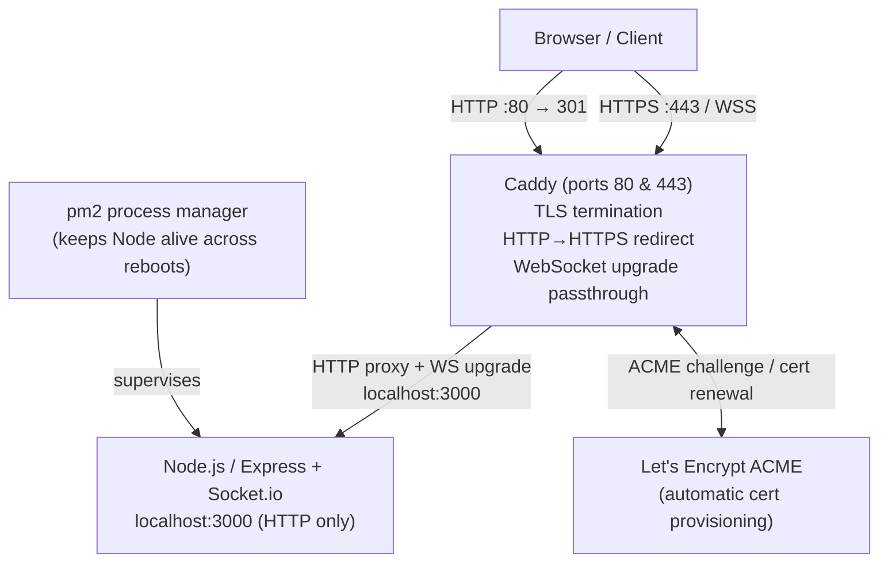
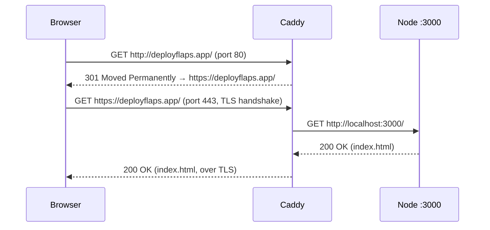
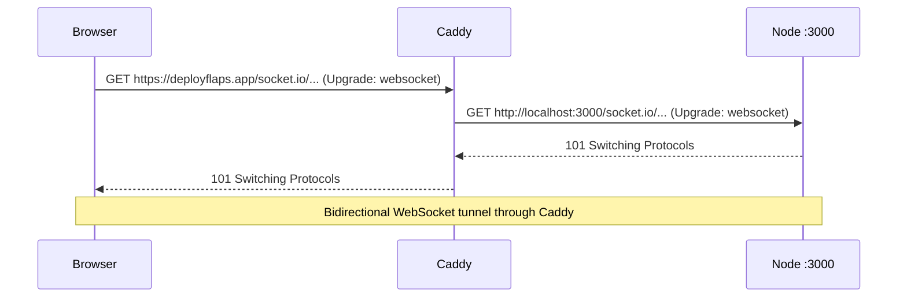
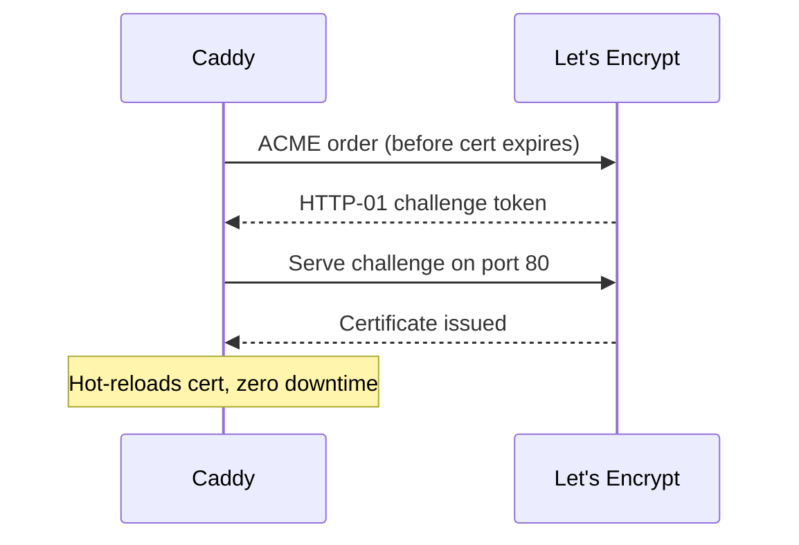

# Design Document: HTTPS Support

## Overview

Add HTTPS to the FLAPS app (deployflaps.app) by placing Caddy in front of the existing Node.js/Express/Socket.io server. Caddy handles TLS termination, automatic Let's Encrypt certificate provisioning and renewal, HTTP→HTTPS redirection, and WebSocket proxying — with zero changes to `server.js`. A process manager (pm2) is also introduced so the Node process survives reboots.

The Node server continues to listen on `localhost:3000` over plain HTTP. All external traffic enters through Caddy on ports 80 and 443.

---

## Architecture



---

## Sequence Diagrams

### Initial HTTPS Request (first visit)



### WebSocket / Socket.io Upgrade



### Certificate Auto-Renewal (background)



---

## Components and Interfaces

### Component 1: Caddy Reverse Proxy

**Purpose**: Terminate TLS, redirect HTTP to HTTPS, proxy all HTTP and WebSocket traffic to the Node process.

**Configuration interface** (`/etc/caddy/Caddyfile`):

```
deployflaps.app {
    reverse_proxy localhost:3000
}
```

Caddy's `reverse_proxy` directive automatically:
- Passes `Upgrade` headers for WebSocket connections
- Forwards `X-Forwarded-For`, `X-Forwarded-Proto`, and `Host` headers
- Handles ACME HTTP-01 challenges on port 80

**Responsibilities**:
- Obtain and renew TLS certificates from Let's Encrypt
- Terminate TLS on port 443
- Redirect all port 80 traffic to HTTPS (built-in Caddy default)
- Proxy HTTP requests and WebSocket upgrades to `localhost:3000`
- Store certificates in `/var/lib/caddy/.local/share/caddy/` (managed automatically)

---

### Component 2: pm2 Process Manager

**Purpose**: Keep the Node.js process running persistently and restart it automatically after VPS reboots.

**Configuration interface** (`ecosystem.config.cjs`):

```javascript
module.exports = {
  apps: [
    {
      name: "flaps",
      script: "server.js",
      interpreter: "node",
      watch: false,
      env: {
        PORT: 3000,
        NODE_ENV: "production"
      }
    }
  ]
};
```

**Responsibilities**:
- Start `node server.js` on system boot (via `pm2 startup` + `pm2 save`)
- Restart the process if it crashes
- Provide log access via `pm2 logs flaps`
- Expose process status via `pm2 status`

---

### Component 3: Node.js Application (unchanged)

**Purpose**: Serve the FLAPS app over HTTP on `localhost:3000`.

**No changes required to `server.js`.** The app already:
- Listens on `process.env.PORT || 3000`
- Serves static files from `public/`
- Handles Socket.io connections

The app does not need to be aware of TLS — Caddy handles it transparently.

---

## Data Models

### Caddy Certificate Store

Caddy manages certificates automatically. No manual data model required. Certificates are stored at:

```
/var/lib/caddy/.local/share/caddy/certificates/
  acme-v02.api.letsencrypt.org-directory/
    deployflaps.app/
      deployflaps.app.crt
      deployflaps.app.key
```

**Validation rules**:
- Caddy renews certificates automatically when fewer than 30 days remain
- Certificates are valid for 90 days (Let's Encrypt standard)
- Port 80 must be reachable from the internet for HTTP-01 ACME challenges

### pm2 Process Descriptor

```javascript
{
  name: "flaps",          // process name in pm2 registry
  script: "server.js",   // entry point (relative to app directory)
  status: "online",      // online | stopped | errored
  pid: Number,           // OS process ID
  uptime: Number,        // milliseconds since last start
  restarts: Number       // total restart count
}
```

---

## Error Handling

### Error Scenario 1: Port 80 or 443 Not Open in Firewall

**Condition**: Caddy starts but ACME challenge fails; browser cannot reach the site on port 443.  
**Response**: Caddy logs `failed to obtain certificate` with ACME error details.  
**Recovery**: Open ports 80 and 443 in the Hostinger VPS firewall/security group, then run `sudo systemctl reload caddy`.

### Error Scenario 2: Node Process Not Running

**Condition**: Caddy is up but `localhost:3000` is not accepting connections.  
**Response**: Caddy returns `502 Bad Gateway` to the browser.  
**Recovery**: `pm2 restart flaps` or `pm2 start ecosystem.config.cjs`. Check `pm2 logs flaps` for crash details.

### Error Scenario 3: pm2 Startup Not Configured

**Condition**: VPS reboots; Node process does not restart automatically.  
**Response**: Site returns 502 until manually restarted.  
**Recovery**: Run `pm2 startup` (follow the printed command), then `pm2 save`. This registers pm2 as a systemd service.

### Error Scenario 4: Caddy Service Not Enabled

**Condition**: VPS reboots; Caddy does not start automatically.  
**Response**: Site is unreachable on ports 80 and 443.  
**Recovery**: `sudo systemctl enable caddy` ensures Caddy starts on boot.

### Error Scenario 5: WebSocket Connections Fail After HTTPS Migration

**Condition**: Client-side Socket.io is hardcoded to `http://` or `ws://`.  
**Response**: Socket.io connections fail with mixed-content or connection errors in the browser console.  
**Recovery**: Ensure `public/app.js` uses a relative Socket.io connection (e.g., `io()` with no URL argument, or `io(window.location.origin)`). Caddy passes WebSocket upgrades transparently, so no server-side changes are needed.

---

## Testing Strategy

### Manual Smoke Tests (post-deployment)

| Test | Expected Result |
|---|---|
| `curl -I http://deployflaps.app/` | `301 Moved Permanently` with `Location: https://deployflaps.app/` |
| `curl -I https://deployflaps.app/` | `200 OK` |
| `curl -vI https://deployflaps.app/ 2>&1 \| grep issuer` | Certificate issued by Let's Encrypt |
| Open `https://deployflaps.app/` in browser | Padlock shown, no mixed-content warnings |
| Create a room and vote | Socket.io works over WSS |
| `pm2 status` | `flaps` process shows `online` |
| Reboot VPS, wait 60s, visit site | Site loads without manual intervention |

### Property-Based / Invariant Checks

These properties must hold after the migration:

- **TLS invariant**: All responses on port 443 are served over a valid TLS connection with a certificate for `deployflaps.app`.
- **Redirect invariant**: Every HTTP request to port 80 receives a 3xx redirect to the HTTPS equivalent URL.
- **WebSocket invariant**: Socket.io connections established over WSS (`wss://deployflaps.app/socket.io/...`) behave identically to the pre-migration WS connections — room state, voting, and reveal all function correctly.
- **Persistence invariant**: After a process restart or VPS reboot, the Node process is running and the site is reachable within 60 seconds.

### No Regression to Existing Tests

The existing unit and property tests (`server.unit.test.js`, `public/app.property.test.js`) run against the Node process directly and are unaffected by this change. They should continue to pass without modification.

---

## Performance Considerations

- Caddy adds one network hop (loopback), which is negligible (sub-millisecond on localhost).
- TLS handshake overhead is a one-time cost per connection; Socket.io's persistent WebSocket connection amortizes this cost.
- Caddy uses HTTP/2 by default for HTTPS, which may improve performance for concurrent asset requests.
- Certificate renewal happens in the background with zero downtime.

---

## Security Considerations

- **TLS 1.2 / 1.3 only**: Caddy's defaults disable older TLS versions and weak cipher suites.
- **HSTS**: Caddy automatically adds `Strict-Transport-Security` headers, preventing protocol downgrade attacks after the first visit.
- **Certificate storage**: Private keys are stored in `/var/lib/caddy/` owned by the `caddy` system user. The Node process does not have access to TLS keys.
- **No secrets in `server.js`**: The Node app remains unaware of TLS; no certificate paths or keys are added to application code.
- **Firewall**: Only ports 22 (SSH), 80 (HTTP/ACME), and 443 (HTTPS) need to be open. Port 3000 should remain closed to external traffic (Caddy proxies to it on loopback only).

---

## Dependencies

| Dependency | Version | Purpose |
|---|---|---|
| Caddy | 2.x (latest stable) | Reverse proxy, TLS termination, ACME |
| pm2 | 5.x (latest stable) | Node.js process manager |
| Let's Encrypt | — | Free TLS certificate authority (used by Caddy automatically) |
| Node.js | existing | Application runtime (no version change required) |

**Installation sources**:
- Caddy: Official Caddy APT repository (`https://caddyserver.com/docs/install#debian-ubuntu-raspbian`)
- pm2: npm global install (`npm install -g pm2`)
