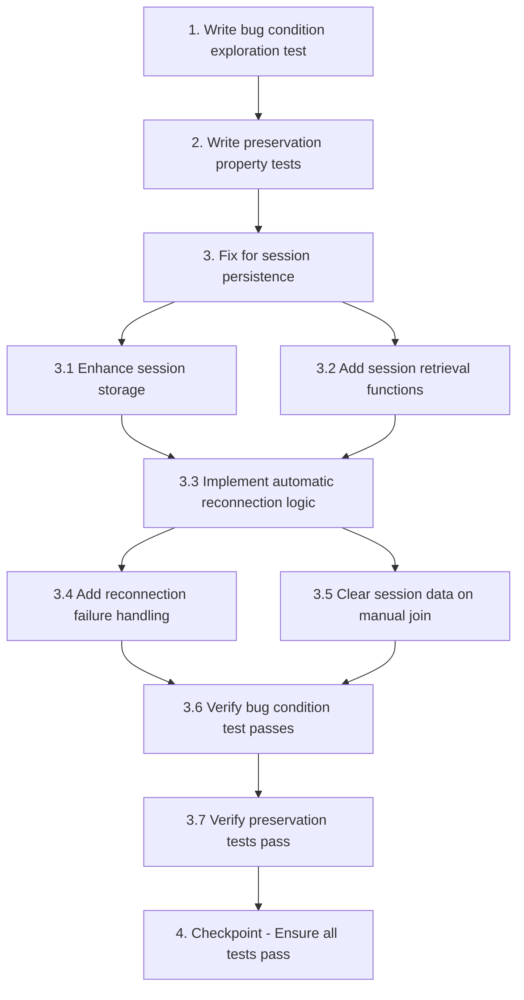

# Implementation Plan

## Overview

This implementation plan follows the bugfix workflow using the bug condition methodology. The bug prevents participants from automatically reconnecting to rooms after Socket.IO disconnections (tab inactive, navigation, refresh). The fix enhances session storage to persist room ID and user name, enabling automatic reconnection while preserving existing functionality for facilitators and first-time users.

**Key Phases:**
1. **Exploration** - Write property-based test to confirm bug exists (will fail on unfixed code)
2. **Preservation** - Write property-based tests to capture existing behavior (must pass on unfixed code)
3. **Implementation** - Apply fix with enhanced session storage and auto-reconnection logic
4. **Validation** - Verify bug is fixed and no regressions introduced

## Tasks

- [x] 1. Write bug condition exploration test
  - **Property 1: Bug Condition** - Participant Automatic Reconnection Failure
  - **CRITICAL**: This test MUST FAIL on unfixed code - failure confirms the bug exists
  - **DO NOT attempt to fix the test or the code when it fails**
  - **NOTE**: This test encodes the expected behavior - it will validate the fix when it passes after implementation
  - **GOAL**: Surface counterexamples that demonstrate the bug exists
  - **Scoped PBT Approach**: For deterministic bugs, scope the property to the concrete failing case(s) to ensure reproducibility
  - Test that when a participant/voter joins a room and their Socket.IO connection is lost (tab inactive, navigation, refresh), they are NOT automatically rejoined upon reconnection
  - Simulate participant joining room with name and room ID
  - Simulate Socket.IO disconnect event
  - Simulate Socket.IO reconnect event
  - Assert that user is NOT in the server's room state (bug condition)
  - Assert that join button is disabled but user cannot participate (bug symptom)
  - The test assertions should match the Expected Behavior Properties from design: user SHOULD be automatically rejoined with stored identity
  - Run test on UNFIXED code
  - **EXPECTED OUTCOME**: Test FAILS (this is correct - it proves the bug exists)
  - Document counterexamples found to understand root cause (e.g., "Participant 'Alice' in room 'ABC123' not rejoined after reconnection, join button disabled, cannot vote")
  - Mark task complete when test is written, run, and failure is documented
  - _Requirements: 1.1, 1.2, 1.3, 1.4_

- [x] 2. Write preservation property tests (BEFORE implementing fix)
  - **Property 2: Preservation** - Non-Reconnection Behavior Unchanged
  - **IMPORTANT**: Follow observation-first methodology
  - Observe behavior on UNFIXED code for non-buggy inputs
  - Write property-based tests capturing observed behavior patterns from Preservation Requirements
  - Property-based testing generates many test cases for stronger guarantees
  - Test cases to observe and capture:
    - First-time join flow: Users visiting room for first time see enabled join button and name input
    - Facilitator auto-rejoin: Facilitators with modKey automatically rejoin on reconnection
    - Manual join capability: Users can manually join by clicking join button
    - Join button state: Join button and name field disabled after successful join
    - Room functionality: Voting, story management, user presence, real-time updates work correctly
    - Multiple user sessions: Each user maintains separate session state
  - Run tests on UNFIXED code
  - **EXPECTED OUTCOME**: Tests PASS (this confirms baseline behavior to preserve)
  - Mark task complete when tests are written, run, and passing on unfixed code
  - _Requirements: 3.1, 3.2, 3.3, 3.4, 3.5, 3.6_

- [x] 3. Fix for session persistence on tab inactive

  - [x] 3.1 Enhance session storage to include room ID and user name
    - Modify `saveJoinedState()` function in `public/app.js` to store additional session data
    - Store `flaps_room_id` with the current room ID in sessionStorage
    - Store `flaps_user_name` with the user's name in sessionStorage
    - Keep existing `flaps_joined_<roomId>` flag for backward compatibility
    - Handle sessionStorage errors gracefully (quota exceeded, unavailable)
    - _Bug_Condition: isBugCondition(input) where input.userRole === 'participant' AND input.connectionState === 'reconnected' AND sessionStorage.hasJoinedFlag === true AND sessionStorage.hasRoomId === false AND sessionStorage.hasUserName === false_
    - _Expected_Behavior: Session storage SHALL contain room ID and user name after successful join, enabling automatic reconnection_
    - _Preservation: First-time join flow, facilitator behavior, and all other room functionality remain unchanged_
    - _Requirements: 2.1, 2.2, 2.4_

  - [x] 3.2 Add session retrieval functions
    - Create `getStoredRoomId()` function to retrieve stored room ID from sessionStorage
    - Create `getStoredUserName()` function to retrieve stored user name from sessionStorage
    - Return null if data is not found or sessionStorage is unavailable
    - Add error handling for corrupted or invalid session data
    - _Bug_Condition: isBugCondition(input) where stored session data is needed for automatic reconnection_
    - _Expected_Behavior: Functions SHALL safely retrieve stored session data or return null if unavailable_
    - _Preservation: No impact on existing code that doesn't use these new functions_
    - _Requirements: 2.1, 2.2, 2.4_

  - [x] 3.3 Implement automatic reconnection logic for participants
    - Modify Socket.IO `connect` event handler in `public/app.js` (around lines 280-295)
    - After existing facilitator auto-rejoin logic, add participant reconnection check
    - Retrieve stored room ID and user name using new retrieval functions
    - If stored session data exists and `isAlreadyJoined()` returns true, automatically emit `room:join` event
    - Set `joinButtonClicked` and `userJoined` flags to maintain UI state consistency
    - Disable join button and name field after successful auto-rejoin attempt
    - Set timeout (5 seconds) to detect reconnection failure
    - _Bug_Condition: isBugCondition(input) where participant reconnects after Socket.IO disconnection_
    - _Expected_Behavior: expectedBehavior(result) - participant SHALL be automatically rejoined with stored identity upon reconnection_
    - _Preservation: Facilitator auto-rejoin, first-time join flow, and manual join capability remain unchanged_
    - _Requirements: 2.1, 2.2, 2.4_

  - [x] 3.4 Add reconnection failure handling
    - Create `handleReconnectionFailure()` function to handle failed auto-rejoin attempts
    - Clear stored session data (room ID, user name, joined flag) from sessionStorage
    - Reset `joinButtonClicked` flag to false
    - Re-enable join button and name field to allow manual rejoin
    - Show user-friendly toast message: "Unable to rejoin. Please join manually." with 'warn' level
    - Call this function from timeout in reconnection logic if `userJoined` is still false after 5 seconds
    - _Bug_Condition: isBugCondition(input) where automatic reconnection fails (invalid room, server error, timeout)_
    - _Expected_Behavior: expectedBehavior(result) - user SHALL be able to manually rejoin when automatic reconnection fails_
    - _Preservation: Manual join flow remains unchanged_
    - _Requirements: 2.3_

  - [x] 3.5 Clear session data on manual join to different room
    - Modify manual join button click handler to clear old session data before joining new room
    - Clear `flaps_room_id` and `flaps_user_name` from sessionStorage
    - Update session data after successful join to new room
    - Ensure session data consistency when user switches between rooms
    - _Bug_Condition: Not directly related to bug condition, but ensures session data integrity_
    - _Expected_Behavior: Session data SHALL be updated correctly when user joins different rooms_
    - _Preservation: Manual join flow behavior remains unchanged_
    - _Requirements: 2.1, 2.2_

  - [x] 3.6 Verify bug condition exploration test now passes
    - **Property 1: Expected Behavior** - Participant Automatic Reconnection Success
    - **IMPORTANT**: Re-run the SAME test from task 1 - do NOT write a new test
    - The test from task 1 encodes the expected behavior
    - When this test passes, it confirms the expected behavior is satisfied
    - Run bug condition exploration test from step 1
    - Verify that participant is automatically rejoined to room after reconnection
    - Verify that user can participate in voting and receive real-time updates
    - Verify that join button remains disabled and user is in server's room state
    - **EXPECTED OUTCOME**: Test PASSES (confirms bug is fixed)
    - _Requirements: 2.1, 2.2, 2.4_

  - [x] 3.7 Verify preservation tests still pass
    - **Property 2: Preservation** - Non-Reconnection Behavior Unchanged
    - **IMPORTANT**: Re-run the SAME tests from task 2 - do NOT write new tests
    - Run preservation property tests from step 2
    - Verify first-time join flow still works (enabled join button for new users)
    - Verify facilitator auto-rejoin still works (facilitators automatically rejoin)
    - Verify manual join capability still works (users can manually join)
    - Verify join button state management still works (disabled after join)
    - Verify room functionality still works (voting, stories, real-time updates)
    - Verify multiple user sessions still work (separate states per user)
    - **EXPECTED OUTCOME**: Tests PASS (confirms no regressions)
    - Confirm all tests still pass after fix (no regressions)

- [ ] 4. Checkpoint - Ensure all tests pass
  - Run all unit tests, property-based tests, and integration tests
  - Verify bug condition test passes (participant auto-reconnection works)
  - Verify preservation tests pass (no regressions in existing functionality)
  - Test manually in browser: join as participant, make tab inactive, return and verify auto-rejoin
  - Test manually in browser: join as participant, refresh page, verify auto-rejoin
  - Test manually in browser: join as facilitator, disconnect, verify facilitator auto-rejoin still works
  - Test manually in browser: first-time user visit, verify join button is enabled
  - Ensure all tests pass, ask the user if questions arise

## Notes

- **Bug Condition Methodology**: This plan uses C(X) to identify buggy inputs (participant reconnection scenarios), P(result) to define expected behavior (automatic rejoin), and ¬C(X) to preserve non-buggy behavior (facilitator auto-rejoin, first-time join flow)
- **Property-Based Testing**: Tasks 1 and 2 use property-based tests to provide stronger guarantees across the input domain
- **Observation-First**: Preservation tests must be run on UNFIXED code first to capture actual baseline behavior
- **Test Ordering**: Exploration and preservation tests MUST be written and run BEFORE implementing the fix
- **Session Storage**: The fix relies on sessionStorage API, which may be unavailable in some contexts (private browsing, quota exceeded) - error handling is included
- **Timeout Handling**: A 5-second timeout detects failed reconnection attempts and allows manual rejoin
- **Backward Compatibility**: Existing `flaps_joined_<roomId>` flag is preserved for compatibility

## Task Dependency Graph



```json
{
  "waves": [
    {
      "name": "Wave 1: Test Preparation",
      "tasks": ["1", "2"]
    },
    {
      "name": "Wave 2: Core Implementation",
      "tasks": ["3.1", "3.2", "3.3"]
    },
    {
      "name": "Wave 3: Error Handling & Cleanup",
      "tasks": ["3.4", "3.5"]
    },
    {
      "name": "Wave 4: Verification",
      "tasks": ["3.6", "3.7"]
    },
    {
      "name": "Wave 5: Final Checkpoint",
      "tasks": ["4"]
    }
  ]
}
```

**Dependency Explanation:**
- Task 1 must complete before Task 2 (understand bug before capturing preservation behavior)
- Tasks 1 and 2 must complete before Task 3 (tests before implementation)
- Task 3.1 and 3.2 must complete before 3.3 (storage functions needed for reconnection logic)
- Task 3.3 must complete before 3.4 and 3.5 (reconnection logic needed before failure handling)
- Tasks 3.4 and 3.5 must complete before 3.6 (all implementation done before verification)
- Task 3.6 must complete before 3.7 (verify fix before checking preservation)
- Task 3.7 must complete before Task 4 (all verification done before final checkpoint)
